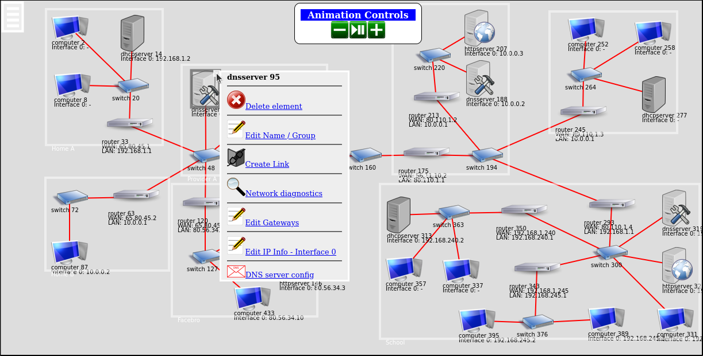

title: Create a Static Web Site using Pelican and Python
slug: create-a-static-site-with-pelican
summary: How to install and configure the Pelican static web site generator, and how to use Pelican themes to make the web site to look the way you want.
date: 2022-09-01
modified: 2022-09-01
category: Blogging
status: published

 
I created this site using [Pelican](https://getpelican.com/), a static site generation tool based on the [Python programming language](https://www.python.org/) and [Jinja2 templates](https://palletsprojects.com/p/jinja/). This post describes how to install and configure Pelican, and how to use Pelican themes to make the web site to look the way you want. In a future post, I will describe how I [published the web site to a hosting provider]({filename}host-static-web-site.md).

## Install Pelican

Install Pelican in a Python virtual environment. I like to create a virtual environment in the same directory as my project, but you may place it anywhere you like.

In my case, I created a directory for my web site and created a virtual environment in it. My web site's name is "Learning with Code" so I named the project directory *learning-with-code*. You may choose any name you like.

Enter the following commands in a terminal window:

```bash
$ mkdir learning-with-code
$ cd learning-with-code
$ pythons -m venv env
$ source env/bin/activate
(env) $
```

Install Pelican in the virtual environment with the [Markdown](https://python-markdown.github.io/) [extras](https://stackoverflow.com/questions/46775346/what-do-square-brackets-mean-in-pip-install) enabled:

```bash
(env) $ pip install "pelican[markdown]"
```

## Initialize the web site project

Run the *pelican-quickstart* command to create the initial files and subdirectories in the web site project. 

```bash
(env) $ pelican-quickstart
```

This script asks some questions and uses your answers to populate the configuration files. In my case, I already registered a URL for my web site so I answered "yes" when asked if I want to specify a URL prefix.  I found the correct responses to the question about time zones can be found in the [Wikipedia list of standard time zones](ttps://en.wikipedia.org/wiki/List_of_tz_database_time_zones). I plan to deploy my website to [Cloudflare Pages](https://pages.cloudflare.com/), or a similar service, via a [GitHub integration](https://developers.cloudflare.com/pages/platform/git-integration) so I don't need Pelican to upload files for me. I answered "no" to the question asking me if I wanted to create a [makefile](https://www.gnu.org/software/make/manual/make.html) to automate publishing.

```bash
> Where do you want to create your new web site? [.] 
> What will be the title of this web site? Learning with Code
> Who will be the author of this web site? Brian Linkletter
> What will be the default language of this web site? [en] 
> Do you want to specify a URL prefix? e.g., https://example.com   (Y/n) y
> What is your URL prefix? (see above example; no trailing slash) https://learnwithcode.com
> Do you want to enable article pagination? (Y/n) y
> How many articles per page do you want? [10] 
> What is your time zone? [Europe/Rome] America/Toronto
> Do you want to generate a tasks.py/Makefile to automate generation and publishing? (Y/n) n
Done. Your new project is available at /home/brian/Projects/learning-with-code
```

The *pelican-quickstart* script created some new directories and configuration files.

```python
(env) $ ls
content  env   output  pelicanconf.py  publishconf.py 
```

The *content* directory contains the source code for blog posts. Each post will be a single markdown file. You may store supporting files like images in subdirectories inside the *content* directory. 

The *output* directory will contain the files generated by Pelican when it creates the static website. Currently, it is empty. The *pelicanconf.py* file is a python scripts that generates configuration information. The *publishconf.py* file is an alternative settings file and is optional. You can go back and edit the Pelican configuration files later when you to add more functionality to your static web site.

### Create your first post

Pelican allows you to write posts in [Markdown format](https://daringfireball.net/projects/markdown/basics). To test the web site build process, create a dummy blog post in the *content* directory:

```bash
(env) $ cd content
(env) $ nano this-is-a-test-post.md
```

Enter the following text, in Markdown format, into the file. You could enter any Markdown text you like but the [metatdata at the top of the post](https://docs.getpelican.com/en/latest/content.html#file-metadata) needs to be arranged similarly to my example, shown below: 

```markdown
title: This is a test post
slug: this-is-a-test-post
summary: This test post should display a summary on the main page and show more detail when you click through to the actual post.
date: 2023-06-07
modified: 2023-06-07

Lorem ipsum dolor sit amet, consectetur adipiscing elit, sed do eiusmod tempor incididunt ut labore et dolore magna aliqua. Ut enim ad minim veniam, quis nostrud exercitation ullamco laboris nisi ut aliquip ex ea commodo consequat.

## Cursus euismod

Duis aute irure dolor in reprehenderit in voluptate velit esse cillum dolore eu fugiat nulla pariatur. Excepteur sint occaecat cupidatat non proident, sunt in culpa qui officia deserunt mollit anim id est laborum.:

1. Malesuada

   Tellus integer feugiat scelerisque varius. Volutpat maecenas volutpat blandit aliquam etiam erat velit scelerisque. 

## Conclusion

This was a test created by copying content from one of my posts
```

Save the file. Navigate back to the project's root folder:

```bash
(env) $ cd ..
```

### Build the site

Run the `pelican` command to build the web site. By default, the `pelican` command looks for posts and other source files in the *content* subdirectory. Since we are using the default configuration values, just run the simple command as shown below: 

```bash
(env) $ pelican
```

In the terminal window, you will see the output indicating the web site has been built. Pelican generates the static web site files in the *output* subdirectory.

### Serve the site

Test the web site by running the `pelican` command with the `--listen` option.

```bash
(env) $ pelican --listen
```

The command output will display a URL you can use to test your web site in a web browser. Open a web browser and enter the URL. In my case, it is *http://127.0.0.1:8000*, which is TCP port 8000 on your's PC's local loopback address. The web site should look similar to the screenshot below:


Stop the server by entering the `CTRL-C` key combination in the terminal window.

The `pelican --listen` command started the [Python web server](https://docs.python.org/3/library/http.server.html) that served the web site's pages from the address *http://localhost:8000*. But, if Pelican creates a "static" web site, why do we need a web server?

### Why run a web server?

The static web site files generated by the `pelican` command need to be presented through a web server that can [interpret the relative path names](https://superuser.com/questions/543744/can-static-websites-be-viewed-without-a-server/1008453#1008453) and find all the content on the site, like CSS files and images. Also, you need a web server to serve the site from a custom URL using [SSL encryption](https://www.cloudflare.com/learning/ssl/what-is-ssl/) so most static web sites will be served this way, anyway.

If you want a truly "static" site that can be served from storage like [S3](https://aws.amazon.com/s3/) with no server then do not use the `pelican` command to generate your web site. Instead, follow the [instructions on the Pelican web site to create a Makefile and use the `invoke` command](https://docs.getpelican.com/en/latest/publish.html#automation) to run the appropriate publishing script for the type of storage you are using.

Using the `pelican` command and the Python HTTP server works for us because we intend to publish this site to a hosting service like [Cloudflare pages](https://pages.cloudflare.com/) or [Netlify](https://www.netlify.com/), which uses the `pelican` command on their servers to build the site from the original source code and serves the site using a [static web server](https://medium.com/swlh/need-a-local-static-server-here-are-several-options-bbbe77e59a11). 


## Site settings

The `pelican-quickstart` script created a settings file named *pelicanconf.py*. Pelican reads this file every time you run the `pelican` command and uses its contents to set environment variables that can control how Pelican builds the static web site files.

If you have already used the `pelican` command to build a web site, then you can view the Pelican settings by running the following command:

```bash
(env) $ pelican --print-settings
```

You will see a long list that shows the value assigned to each Pelican settings variable. You can find a [description of all the settings](https://docs.getpelican.com/en/latest/settings.html) on the Pelican wiki.

There are many possible settings and only a few of them are already set in the *pelicanconf.py* file. It is a good idea to 'document' your configuration by entering in all the variables your site will need and configure them either with their default value or with your preferred value.

 The following list describes some of the settings that I configured in my *pelicanconf.py* settings file.
:

```PYTHON
SITENAME = 'Learning with Code'
SITEURL = 'https://learningwithcode.com'
AUTHOR = 'Brian Linkletter'
LINKS = (('Network Simulators Blog', 'https://brianlinkletter.com/'),)
SOCIAL = (("github", "https://github.com/blinklet"), ('linkedin', 'https://www.linkedin.com/in/brianlinkletter/'), ('twitter', 'http://twitter.com/belinkletter'),)
STATIC_PATHS = ['images', 'extras']
PAGE_PATHS = ['pages']
ARTICLE_PATHS = ['']
SUMMARY_MAX_LENGTH = None
TIMEZONE = 'America/Toronto'
DEFAULT_LANG = 'en'
DEFAULT_PAGINATION = 10
RELATIVE_URLS = True
DEFAULT_CATEGORY = 'Python'
MARKDOWN = {'extension_configs': {'markdown.extensions.codehilite': {'css_class': 'highlight'}, 'markdown.extensions.extra': {}, 'markdown.extensions.meta': {}, 'markdown.extensions.admonition': {}, 'markdown.extensions.toc': {}}, 'output_format': 'html5'}
OUTPUT_PATH = 'output/'
PATH = 'content/'
THEME = 'notmyidea'
THEME_STATIC_DIR = 'theme'
FEED_ALL_ATOM = None
CATEGORY_FEED_ATOM = None
TRANSLATION_FEED_ATOM = None
AUTHOR_FEED_ATOM = None
AUTHOR_FEED_RSS = None
FEED_ATOM = None
FEED_ATOM_URL = None
FEED_RSS = None
FEED_RSS_URL = None
FEED_DOMAIN = None
```

### Using alternative settings files

Pelican reads the variables defined in its settings file every time it builds the web site. The default settings file is *pelicanconf.py*. However, the `pelican-quickstart` script also created an alternative settings file named *publishconf.py*. The alternative file has some settings that would be appropriate for publishing the site to a host site.

To build your static site with an alternative settings file, run the `pelican` command with the `--settings` option and pass in the alternative file path.

```bash
(env) $ pelican --settings ./publishconf.py
```

If you do need a separate settings file for publishing, use the *publishconf.py* file as a template. You will see that it imports all the settings from *pelicanconf.py* and then you can change or add variables that are required specifically for your published site. For example, you might have RSS feed generation turned off on your development site but want feed generation turned on for your published site.

You may also create other settings files if you are experimenting with different settings or themes.

In my case for now, I use only the *pelicanconf.py* settings file.

## Themes

The default Pelican site theme looks okay but bloggers like to customize their blogs. Pelican makes it easy to change your blog theme by downloading prepared theme folders from the Internet or from GitHub. 

Pelican themes consist of templates and CSS files stored in a directory. To change the web site theme, set the *THEME* variable in the *pelicanconf.py* file to point to the directory containing your new theme files. 

### Where to find themes

The Pelican project team maintains a [GitHub repository that points to many available Pelican themes](https://github.com/getpelican/pelican-themes). You can also search the Internet for Pelican themes that are not tracked in the *pelican-themes* GitHub repository.

Some themes I like are:

* [*Flex*](https://flex.alxd.me/)
* [*Papyrus*](https://aleylara.github.io/Papyrus/)
* [*Attila*](https://github.com/arulrajnet/attila-demo)
* [*Astrochelys*](https://github.com/out-of-cheese-error/astrochelys)

### How to install themes

There are three ways to set up themes on your system:

1. Use the [instructions in the *pelican-themes* repository](https://github.com/getpelican/pelican-themes#pelican-themes), which tell you to use Git to copy the entire repository to a directory on your local machine and point the THEME variable in your config file to a specific folder in the repo directory.
2. Use the `pelican-themes --install` command to copy files to a theme folder in your Python virtual environment's Pelican package directory. Then point the THEME variable in your config file to the name of the theme. You do not need to specify the path to the theme folder. 
3. Manually copy the theme files to a directory named *themes* at the root level of your blog project and point to it in your config file. You might use this method if you want to track changes to your theme files in your source control system.

When starting a Pelican-based blog, you will probably want to install multiple themes so you can experiment with the way your site looks so I prefer the second method listed above. I find themes I want to try and copy them from their author's web sites or repositories. This way, I can also download and install themes that are not part of the pelican-themes repository.

First, use the [`pelican-themes -l`](https://docs.getpelican.com/en/latest/pelican-themes.html) command to see which themes already exist on your system:

```bash
(env) $ pelican-themes --list
```

Pelican comes with two themes as part of its standard installation. 

```bash
notmyidea
simple
```

You can verify the theme used by your blog using the `pelican --print-settings` command:

```bash
(env) $ pelican --print-settings THEME
```

This will display the actual value of the THEME variable used by Pelican:

```bash
THEME: '/home/brian/Projects/learning-with-code/env/lib/python3.10/site-packages/pelican/themes/notmyidea'
```

### Install the "Flex" theme

As an example, I will change the blog theme to the Flex theme. To install the Flex theme, go to the Flex theme's GitHub repository and click on the [Tags](https://github.com/alexandrevicenzi/Flex/tags) link. Take the latest stable release, which is 2.5.0 at the time I wrote this post.

Download and uncompress the release archive so all the files are installed in a directory named Flex-2.5.0.

```bash
(env) $ cd ~/Downloads
(env) $ wget https://github.com/alexandrevicenzi/Flex/archive/refs/tags/v2.5.0.zip
(env) $ unzip v2.5.0.zip
```

Use the `pelican-themes -i` command to copy the files to the Pelican install in your Python packages directory.

```bash
(env) $ pelican-themes --install ~/Downloads/Flex-2.5.0/
```

See that the new theme is installed:

```bash
(env) $ pelican-themes --list
Flex-2.5.0
notmyidea
simple
```

See the actual paths to the theme folders in your Python environment:

```bash
(env) $ pelican-themes --list --verbose
```

The output lists the absolute path of each theme installed using the pelican-themes command. You can see they are all installed in the *site-packages/pelican/themes* subdirectory in your Python environment.

```bash
/home/brian/Projects/learning-with-code/env/lib/python3.10/site-packages/pelican/themes/notmyidea
/home/brian/Projects/learning-with-code/env/lib/python3.10/site-packages/pelican/themes/simple
/home/brian/Projects/learning-with-code/env/lib/python3.10/site-packages/pelican/themes/Flex-2.5.0
```

You may delete the theme archive you originally downloaded if you want to save some space. They are not needed anymore.

```bash
(env) $ rm v2.5.0.zip
(env) $ rm -r Flex-2.5.0
```

Now switch to the Flex theme by editing or adding the *THEME* variable in the *pelicanconf.py* file:

```python
THEME = 'Flex-2.5.0'
```

You did not have to enter the full path to the theme directory (although that would work) because the theme directory is installed in Pelican's default themes directory. So, you just assign the name of the installed theme to the *THEME* variable.

Save the file. Then run pelican again

```bash
(env) $ pelican
(env) $ pelican --listen
```

When you open the URL *http://localhost:8000* in your web browser, you can see the theme has changed. 


### Configure a new theme

To get the most out of a new theme, you need to change more than just the value of the *THEME* variable. Most themes are configured by adding additional theme-specific variables to the *pelicanconf.py* file. 

Read the documentation provided by the theme's author. For example, the [Flex theme's documentation](https://github.com/alexandrevicenzi/Flex/wiki/Custom-Settings) lists all the variables that you can use to change the look and function of the Flex theme.

For example, setting the *USE_GOOGLE_FONTS* variable to *True* or *False* enables or disables use of Google Fonts. If you care about your users' privacy, you may want to disable Google Fonts.

To configure the Flex theme, I added the following lines at the bottom of my *pelicanconf.py* file:

```python
# Configuration for Flex theme
from datetime import datetime

SITELOGO = ''
FAVICON = ''
SITESUBTITLE = 'Learning how to use Python for work and for fun'
SITEDESCRIPTION = 'Learning how to use Python for work and for fun: Data science, networking, internet of things'
USE_GOOGLE_FONTS = True
BROWSER_COLOR = '#333333'
PYGMENTS_STYLE = 'monokai'
MAIN_MENU = True
MENUITEMS = (("Categories", "/categories.html"),)
COPYRIGHT_YEAR = datetime.now().year
CC_LICENSE = {
    "name": "Creative Commons Attribution-ShareAlike 4.0 International License",
    "version": "4.0",
    "slug": "by-sa",
    "icon": True,
    "language": "en_US",
}
HOME_HIDE_TAGS = True
DISABLE_URL_HASH = True
THEME_COLOR_AUTO_DETECT_BROWSER_PREFERENCE = True
THEME_COLOR_ENABLE_USER_OVERRIDE = True
```

Save the *pelicanconf.py* file and run the `pelican` command again.

```bash
(env) $ pelican
```

Then, open your web browser at the URL, *https://localhost:8000*. You will see how the theme-specific settings have changed the look of the web site:


Other themes and other add-ons, like plugins, may require more variables to be set up in the Pelican settings file. 

## Add images to posts

Some blog posts, like this one, include images or other file types, like audio files, that need to be included in the generated static web site. 

To add images to your blog, first create a new subdirectory in the *content* directory called *images*. I like to create a sub-directory under *images* for each post so I know which images go with which post.

Then, add some image files to the *images* subdirectory and create a new blog post in the *content* directory that uses the images. The blog post could look like the one below:

```markdown
title: Image test
slug: image-test-post
summary: This test post should display a post with in-line images.
category: Examples
date: 2023-06-09
modified: 2023-06-09

Lorem ipsum dolor sit amet, consectetur adipiscing elit, sed do eiusmod tempor incididunt ut labore et dolore magna aliqua. 



Ut enim ad minim veniam, quis nostrud exercitation ullamco laboris nisi ut aliquip ex ea commodo consequat.

## Conclusion

This was a test of images in a post
```

After you re-run the `pelican` and `pelican --listen` commands, you should see that th enew post looks like the following screen shot.


The image is shown in-line with the rest of the post, just like you would expect. 


### Configuring static file directories

The Pelican documentation suggests you need to configure settings to [tell Pelican which directories contain static content](https://docs.getpelican.com/en/latest/content.html#linking-to-static-files), like images, that should not be processed by Pelican. I find that Pelican ignores standard image files by default but, to be careful, you may want to follow the recommendation in Pelican's documentation and configure the *STATIC_PATHS* variable in the settings file to point to the *images* subdirectory. 

For example, I have the following line in my *pelicancanf.py* file, where I tell Pelican that files in the *images* and *extras* subdirectoryies are to be used in the blog but not processed by Pelican:

```python
STATIC_PATHS = ['images', 'extras']
```

That way if I ever store another type of file in the *extras* folder, for example, Pelican will use it as-is in whichever post links to it, without trying to process it into a separate blog post.

If you start seeing errors when you run the `pelican` command, it is possible that Pelican is trying to process files you want it to ignore. Check your settings file and make sure you have the correct values in the following variables: *STATIC_PATHS*, *PAGE_PATHS*, and *ARTICLE_PATHS*.

### More information about writing posts

I don't want to duplicate the Pelican documentation. There are lots more details related to writing posts that you need to know, such as how to embed links in your posts, and more.

The [Pelican documentation provides clear instructions](https://docs.getpelican.com/en/latest/content.html#writing-content) that cover all these details. At this point, I think you are ready to start building a web site and exploring more about Pelican.

## Conclusion

This post covered the basics of creating a Pelican blog and writing a few posts. But, the blog currently exists only in a folder on your PC. In the next posts, I will discuss how to publish the blog on a web host provider so anyone can access it.

