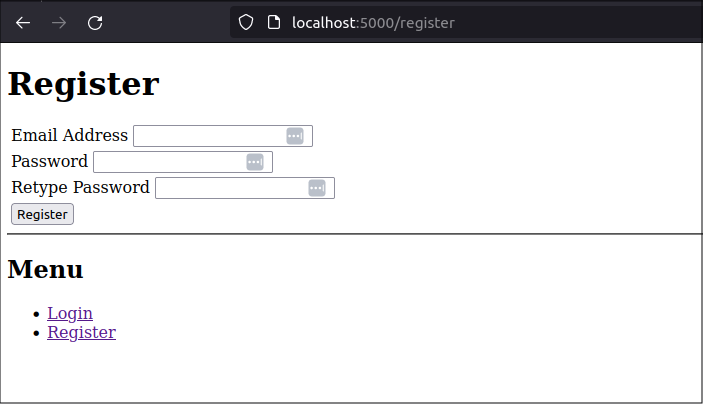
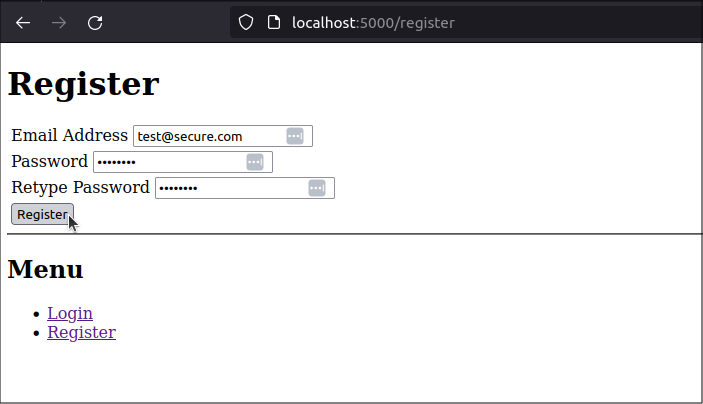

title: Add Flass-Security-Too to a Python web app
slug: flask-security-too-python
summary: After creating a basic web app that has several web pages, I need to add the ability to manage user access and permissions on the app. This post shows how I integrated the Flask-Security-Too extension into my existing web app. 
date: 2024-04-20
modified: 2024-04-20
category: Flask
status: Draft

# Look into Flask-AppBuilder extension


<!--
A bit of extra CSS code to centre all images in the post
-->
<style>
img
{
    display:block; 
    float:none; 
    margin-left:auto;
    margin-right:auto;
}
</style>


get tagged starting point (.001)

```
$ wget https://github.com/blinklet/music-festival-organizer/archive/refs/tags/0.001.zip
$ unzip 0.001.zip
$ $ ls -1
0.001.zip
music-festival-organizer-0.001
$ cd music-festival-organizer-0.001
$ ls -1
docs
LICENSE.txt
mfo
mfo1
mfo2
README.md
requirements.txt
```

We're only interested in the *mfo* subdirectory. All the other directories have old information you can ignore.

See the file structure of the basic project:

```
$ tree mfo
mfo
├── account
│   ├── account.py
│   ├── static
│   │   └── css
│   │       └── styles.css
│   └── templates
│       └── account
│           ├── index.html
│           ├── login.html
│           └── register.html
├── admin
│   ├── admin.py
│   └── templates
│       └── admin
│           └── index.html
├── app.py
├── config.py
├── dotenv_example
├── home
│   ├── home.py
│   └── templates
│       └── home
│           └── index.html
├── requirements.txt
├── static
│   └── css
│       └── styles.css
└── templates
    └── shared_layout.html

14 directories, 15 files
```

To review how the project currently runs, activate the virtual environment

```text
$ cd mfo
$ python3 -m venv .venv
(.venv) $ pip install -r requirements.txt
```

### Make directories packages

Then, to fix an error I made previously, add an empty */_/_init/_/_.py* file to the *mfo* directory to make it a package. This will allow module imports to work inside the directory so the application will work when I run `flask run` in the *mfo* directory.

```text
(.venv) $ touch __init__.py
```

And, while we're at it, make each of the blueprint directories a sub-package by also adding empty */_/_init/_/_.py* files in them:

```text
(.venv) $ touch account/__init__.py
(.venv) $ touch admin/__init__.py
(.venv) $ touch home/__init__.py
```

### Set up th eenvironment variables

Create a [*dotenv* file]() named *.env*:

```text
(.venv) $ nano .env
```

Add the following environment variables to it:

```python
FLASK_ENVIRONMENT = development
FLASK_APP = app
FLASK_DEBUG = True
FLASK_SECRET_KEY = abcd
FLASK_EXPLAIN_TEMPLATE_LOADING = True
```

Save the file and exit the editor.

### Run the Flask app

Then, run the Flask application

```text
(.venv) $ flask run
 * Serving Flask app 'app'
 * Debug mode: on
WARNING: This is a development server. Do not use it in a production deployment. Use a production WSGI server instead.
 * Running on http://127.0.0.1:5000
Press CTRL+C to quit
 * Restarting with stat
 * Debugger is active!
 * Debugger PIN: 140-445-079
```


Open a web browser to the address: `http://127.0.0.1:5000` to see the first page in the web app. 


See my previous post about [organizing a large Flask application with Blueprints]() to see screenshots that show the application running.

Stop the application using the *CTRL-C* key combination.

# Add Flask-Security-Too

## Install Flask-Security-Too package

Add *Flask-Security-Too* to the *requirements.txt* file. The new file will look like the following:

```text
# mfo/requirements.txt

flask
python-dotenv
Flask-Security-Too[fsqla,common]
```

*Flask-Security-Too* also installs *Flask-SQLAlchemy*, *Flask-Login*, *Flask-WTF*, and other Flask extensions so you do not need to list them in the file.

Then, install the requirements into the virtual environment, again:

```text
(.venv) $ pip install -r requirements.txt
```

You will see many packages are installed.

## Configuration

*Flask-Security-Too* needs additional configuration variables defined. Add database config information and Flask-Security-Too configuration information to *config.py* and, if needed, *.env* files.

```python
# mfo/config.py

import os
import dotenv

app_dir = os.path.abspath(os.path.dirname(__file__))
project_dir = os.path.abspath(app_dir)
dotenv.load_dotenv()

# General Config
ENVIRONMENT = os.environ.get("FLASK_ENVIRONMENT")
DEBUG = os.environ.get("FLASK_DEBUG")
SECRET_KEY = os.environ.get("FLASK_SECRET_KEY")
SERVER_NAME = os.environ.get("FLASK_SERVER_NAME")
EXPLAIN_TEMPLATE_LOADING = os.environ.get("FLASK_EXPLAIN_TEMPLATE_LOADING")

# Flask-SQLAlchemy variables
SQLALCHEMY_DATABASE_URI = os.environ.get("SQLALCHEMY_DATABASE_URI")
SQLALCHEMY_ECHO = os.environ.get("SQLALCHEMY_ECHO")
SQLALCHEMY_TRACK_MODIFICATIONS = os.environ.get("SQLALCHEMY_TRACK_MODIFICATIONS")
SQLALCHEMY_ENGINE_OPTIONS = {"pool_pre_ping": True}  # From Flask-Security-Too configuration recommendations. 
# See: https://flask-security-too.readthedocs.io/en/stable/quickstart.html#sqlalchemy-application
# See: https://docs.sqlalchemy.org/en/20/core/pooling.html#disconnect-handling-pessimistic

# Flask-Security variables
SECURITY_PASSWORD_SALT = os.environ.get("SECURITY_PASSWORD_SALT")
SECURITY_ANONYMOUS_USER_DISABLED = True 
# See: https://flask-security-too.readthedocs.io/en/stable/changelog.html#notes
SECURITY_REGISTERABLE = True
SECURITY_SEND_REGISTER_EMAIL = False
```

Define the following values in the *.env* file:


```python
# mfo/.env

FLASK_ENVIRONMENT = development
FLASK_APP = app
FLASK_DEBUG = True
FLASK_SECRET_KEY = LGBoUEDCCpgwxy5jZxpu9e01MTnRVqnG6A8ceD7Z4YU
FLASK_EXPLAIN_TEMPLATE_LOADING = False

# Flask-SQLAlchemy variables
# --------------------------
SQLALCHEMY_DATABASE_URI = ""
SQLALCHEMY_ECHO = False

# Flask-Security variables
# ------------------------
SECURITY_PASSWORD_SALT  = 307680677384259925768439955171685999662
```

## Database

Create a database folder named *database*. In it, create a *models* directory and, in that directory, create a model for the application users named *users.py*.

```text
(.venv) $ mkdir database
(.venv) $ cd database
(.venv) $ mkdir models
(.venv) $ cd models
(.venv) $ nano users.py
```

The *users.py* file will look like below:

```python
from mfo.database.setup import db
from flask_security.models import fsqla_v3 as fsqla
from flask_security import SQLAlchemyUserDatastore

fsqla.FsModels.set_db_info(db)

class Role(db.Model, fsqla.FsRoleMixin):
    pass

class User(db.Model, fsqla.FsUserMixin):
    pass

user_datastore = SQLAlchemyUserDatastore(db, User, Role)
```

> **TODO** explain the default model for User and Roles and how to expand them

Back in the *database* folder, create a *setup.py* file that creates the SQLAlchemy database object and the Flask-Security-Too datastore object:

```text
(.venv) $ cd ..
(.venv) $ nano setup.py
```

The *setup.py* file will look like below:

```python
# mfo/database/setup.py
 
from flask_sqlalchemy import SQLAlchemy
from sqlalchemy.orm import DeclarativeBase
from flask import current_app

class Base(DeclarativeBase):
    pass

db = SQLAlchemy(model_class=Base)

# Create database, if none 
def create_database():
    with current_app.app_context():
        security = current_app.security
        security.datastore.db.create_all()
```

## The app file

```python
# mfo/app.py

import flask

from flask_security import Security

from mfo.database.setup import db, create_database
from mfo.database.models.users import user_datastore


app = flask.Flask(__name__)
app.config.from_pyfile('config.py', silent=True)

# Configure Flask-SQLAlchemy
db.init_app(app)

# Configure Flask_Security
app.security = Security(app, user_datastore)

# Register blueprints
from mfo.admin import admin
from mfo.home import home
from mfo.account import account
app.register_blueprint(home.bp)
app.register_blueprint(account.bp)
app.register_blueprint(admin.bp)

# Create application database, if one does not exist
with app.app_context():
    create_database()


if __name__ == "__main__":
    app.run()
```

## Run program

```text
(.venv) $ flask run
```

The web site works the same because Flask adds routes to */login* and */register*, among others. My *accounts* blueprint no loger points to the correct routes.

Go to `http://127.0.0.1:5000/register`



Create a new user

user name = test@secure.com
password = password



Click on the *submit* button


config
Add database setup and models
add flask-security config to app.py
add correct links to account page

test
show that the login screen loses my nav bar and formtting
fix by customizing templates
show the security templates in Github or in the venv folder

show database content
show the user and roles classes in Github or in the venv folder


Default account routes used by Flask-Security-Too are /login and /register. So my old system with an *account* blueprint using /account/login and /account/register will not work.

I could maybe try to "overload" parts of the *security* blueprint by creating and registering my own security blueprint, or I could configure settings like SECURITY_LOGIN_URL (https://flask-security-too.readthedocs.io/en/stable/configuration.html) so the routes appear where I want them but, let's keep things simple and let Flask-Security-Too do what it wants, for now. I will remove the *account* route from my program and use the routes provided by Flask-Security-Too

I changed the *home* blueprint so it has link that allow users to login and register.
Also, the /templates/shared_layout.html -- changed the nav links


To override the templates used by Flask-Security: https://flask-security-too.readthedocs.io/en/stable/customizing.html

1) Go to Flask-Security-Too Git repo
2) Copy the login template (https://github.com/Flask-Middleware/flask-security/blob/master/flask_security/templates/security/login_user.html)
3) Create a folder named security within my app's templates folder
4) Create a template with the same name for the template you wish to override
  a) In this case: /templates/security/login_user.html


## app.py

Add `from mfo.database import db` and `db.base.init_app(app)` to the app file to configure flask-sqlalchemy using the Flask app configuration established in the *config.py* file. The add the`db.create_all()` statement to build the database tables, if they do not yet exist

```python
# mfo/app.py

import flask

from mfo.database.setup import db

from mfo.admin import admin
from mfo.home import home
from mfo.account import account


app = flask.Flask(__name__)
app.config.from_pyfile('config.py', silent=True)

# Configure Flask extensions
db.init_app(app)

# Register blueprints
app.register_blueprint(home.bp)
app.register_blueprint(account.bp)
app.register_blueprint(admin.bp)


if __name__ == "__main__":
    app.run()
```


see:
https://flask-security-too.readthedocs.io/en/stable/quickstart.html#basic-sqlalchemy-application
https://github.com/hrishikeshrt/flask-bootstrap-anywhere/tree/master

https://blog.teclado.com/user-authentication-flask-security-too/
https://blog.teclado.com/customise-pages-emails-flask-security-too/
https://blog.teclado.com/email-confirmation-flask-security-too/


https://jinja.palletsprojects.com/en/3.0.x/tricks/   explains the "set active_page" variable in flask-bootstrap-anywhere templates
Useful for highlighting active page in nav bar
