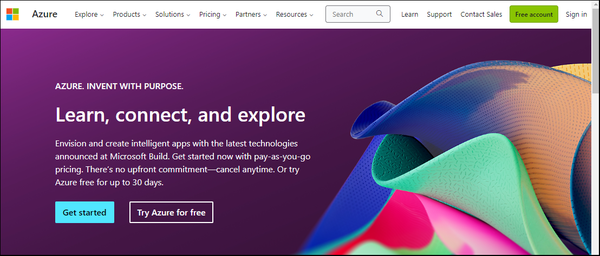
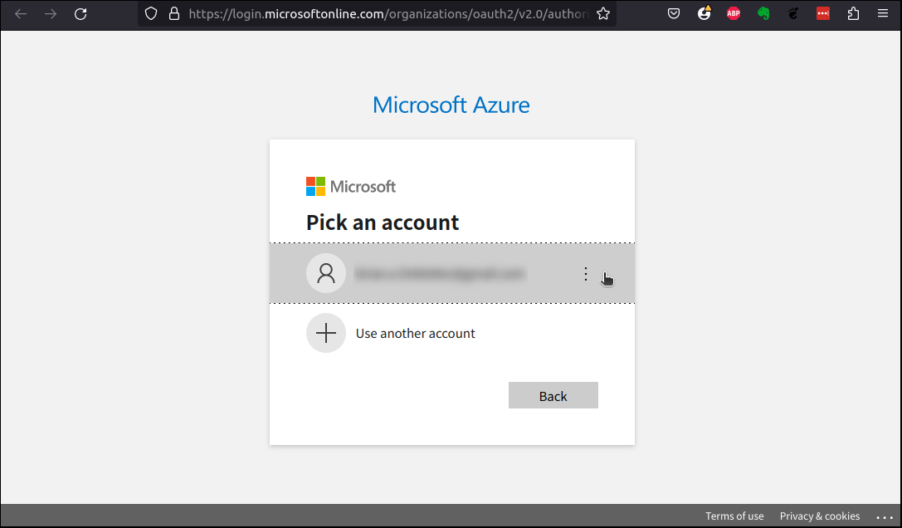

title: Create a sample database on Azure cloud
slug: create-sample-db-azure
summary: For the purpose of practicing Python data analytics programming, create your own personal database server on Microsoft's Azure cloud, populate it with sample data, and run the server on Azure's free service tier, which lasts for twelve months
date: 2022-05-14
modified: 2022-05-14
category: Databases
<!--status: published-->

[Data science](https://en.wikipedia.org/wiki/Data_science) has been a hot topic for more than a few years. There is a lot of information available online that will help you learn how to use Python to work with data. But I noticed one particular topic is often not covered in enough practical detail: how to use Python to access data from an SQL database.

Many data sets that are [available to the public](https://www.dropbase.io/post/top-11-open-and-public-data-sources) but very few of them run on database servers. If you want to learn how to analyze data stored in a database, you need readily-available sample data that can be loaded into the database and you need access to a database server. 

Microsoft offers solutions to both these challenges. They offer the multiple [sample databases](https://learn.microsoft.com/en-us/sql/samples/sql-samples-where-are?view=sql-server-ver16) and they make it easy to create a free [^1] database server that is [pre-loaded with the AdventureWorks sample database](https://learn.microsoft.com/en-ca/azure/azure-sql/database/free-sql-db-free-account-how-to-deploy?view=azuresql). 

[^1]: Microsoft Azure offers a [free service tier](https://azure.microsoft.com/free/) that, in addition to offering $200 in services for free for 30 days, allows you to run small configurations of certain service for 12 months at no cost.

This post will show you how to create your own personal database server on Microsoft's Azure cloud, populate it with the AdventureWorks sample database, and connect to the server. I will cover the details of exploring databases using various Python functions in future posts.

## How to configure services in Azure's free service tier

Microsoft Azure allows many different methods to configure services. You may use [Azure Portal](https://learn.microsoft.com/en-us/azure/azure-portal/), [Azure CLI](https://learn.microsoft.com/en-us/cli/azure/?view=azure-cli-latest), [Azure Resource Manager](https://learn.microsoft.com/en-us/azure/azure-resource-manager/management/overview), [Terraform](https://learn.microsoft.com/en-us/azure/developer/terraform/overview), Microsoft's [Python API](https://learn.microsoft.com/en-us/python/api/overview/azure/resources?view=azure-python) [^2], and more.

[^2]: I cover Azure's Python API in my post about [creating the *azruntime* program]({filename}manage-azure-infrastructure-python.md).

Azure Portal is a web interface and is easy to use, but Azure CLI is easiest to include in a blog post where the reader may want to copy and paste steps. I will show you how to quickly create a sample database using Azure CLI and then show you how to connect to it using Python libraries. I will show you how to use Azure Portal in an appendix at the end of this post.

### Create an Azure account

If you do not already have an Azure account, [create one](https://learn.microsoft.com/en-us/dotnet/azure/create-azure-account). Go to [https://azure.com](https://azure.com) and click on the *Free account* button.



In the next few pages that appear, you agree to terms and conditions and enter your user information such as your e-mail address and password.


### Install Azure CLI

Azure CLI can be installed on [all major operating systems](https://learn.microsoft.com/en-us/cli/azure/install-azure-cli), including Linux. To install Azure CLI on Ubuntu, run the following command in your terminal window:

```bash
$ curl -sL https://aka.ms/InstallAzureCLIDeb | sudo bash
```

Or, if you don't like piping a third-party bash script through *sudo*, follow the [step-by-step install instructions](https://learn.microsoft.com/en-us/cli/azure/install-azure-cli-linux?pivots=apt#option-2-step-by-step-installation-instructions) provided by Azure.

### Log into your Azure account

To login to your Azure account using Azure CLI, run the following command:

```bash
$ az login
```

This starts login with interactive mode. A browser window will open up and ask you for your Azure account userid and password



Enter userid and then enter your password at the next screen. Adter you login, you should see your account information printed in the terminal window, similar to the account information below:

```json
[
  {
    "cloudName": "AzureCloud",
    "homeTenantId": "bdface03-6fad-4ke4-8fa7-10dface34567",
    "id": "e0caca48-577e-4322-a566-b7666607caca",
    "isDefault": true,
    "managedByTenants": [],
    "name": "Azure subscription 1",
    "state": "Enabled",
    "tenantId": "bdface03-6fad-4ke4-8fa7-10dface34567",
    "user": {
      "name": "my.email.address@gmail.com",
      "type": "user"
    }
  }
]
```

#### Solving login problems

Azure has multiple ways to login with Azure CLI. If you have trouble logging in with the interactive method, check the [Azure CLI login instructions](https://learn.microsoft.com/en-us/cli/azure/authenticate-azure-cli) for other methods.

For example, since I use multi-factor authentication, I had to use the following command to login:

```bash
$ az login --use-device-code
```

## Create a free SQL Server on Azure

When you are operating as a data analyst, you will be almost always be a "user" of an existing database and the database administrator will have provided you with the login credentials you need to read data from it. However, if you want to create a database that you can experiment with, you need to set up a database server and a database, yourself. 

This section describes the minimum configuration required to set up a free sample database for practice purposes. I do not cover SQL database administration topics like adding new database users, setting up user roles and permissions.

### Free service tier restrictions

Microsoft provides some good examples of [using Azure CLI to set up an SQL Server database](https://learn.microsoft.com/en-us/azure/azure-sql/database/scripts/create-and-configure-database-cli?view=azuresql). But, their example cover configurations that are not supported by the free service tier. The largest server configuration supported on the free tier is:

* 1 S0 database
* 10 database transaction units
* 250 GB storage

Below, I show the commands that will set up an [SQL Server that will run on the free tier](https://learn.microsoft.com/en-us/azure/azure-sql/database/free-sql-db-free-account-how-to-deploy?view=azuresql).


### Use Azure CLI to create the database

You need to know the Azure location where you will deploy your services. Pick one located close to you. Next, you need to decide what names you will assign to your resource group, server, and database. You will also have to choose your SQL database userid and password. 

Assign your database server configuration information to shell variables so you can easily use them in your Azure CLI commands:

```bash
$ location="eastus"
$ resource_group="new-resource-group-name"
$ server="my-sql-server-name"
$ database="my-sql-database-name"
$ login="sqldb_userid"  (brianbrian)
$ password="sqldb_passwd" (Jt&4cQb7VurIU$zC)
```

```bash
location="eastus"
resource_group="rg1967"
server="sqlserver1967"
database="db1967"
login="sqldbuserid"
password="Jt984cQb7VurIUuuzC"
```


#### Create a resource group 

Create a resource group if you have not already created one

```bash
$ az group create --name $resource_group --location "$location"
```

When the command completes, it will output the information about the newly-created resource group in jason format.

```json
{
  "id": "/subscriptions/e0caca48-577e-4322-a566-b7666607caca/resourceGroups/new-resource-group-name",
  "location": "eastus",
  "managedBy": null,
  "name": "new-resource-group-name",
  "properties": {
    "provisioningState": "Succeeded"
  },
  "tags": null,
  "type": "Microsoft.Resources/resourceGroups"
}
```


#### Create an SQL Server

Create an SQL Server instance that will run in the free service tier

```bash
$ az sql server create \
  --name $server \
  --resource-group $resource_group \
  --location $location \
  --admin-user $login \
  --admin-password $password
```

The server name needs to be unique to the Azure location.

The command will take a few minutes to complete. When it is completed, it will output the server's information to the terminal in JSON format.

```json
{
  "administratorLogin": "brianbrian",
  "administratorLoginPassword": null,
  "administrators": null,
  "externalGovernanceStatus": "Disabled",
  "federatedClientId": null,
  "fullyQualifiedDomainName": "my-sql-server-name.database.windows.net",
  "id": "/subscriptions/e0caca48-577e-4322-a566-b7666607caca/resourceGroups/new-resource-group-name/providers/Microsoft.Sql/servers/my-sql-server-name",
  "identity": null,
  "keyId": null,
  "kind": "v12.0",
  "location": "eastus",
  "minimalTlsVersion": "1.2",
  "name": "my-sql-server-name",
  "primaryUserAssignedIdentityId": null,
  "privateEndpointConnections": [],
  "publicNetworkAccess": "Enabled",
  "resourceGroup": "new-resource-group-name",
  "restrictOutboundNetworkAccess": "Disabled",
  "state": "Ready",
  "tags": null,
  "type": "Microsoft.Sql/servers",
  "version": "12.0",
  "workspaceFeature": null
}
```

Add administration information

```bash
$ az sql server ad-admin
```

#### Create an SQL database instance

**WARNING: May need to create firewall rule first? Seems to have helped my connection issue???**


Create an SQL database instance that will run on your server and populate it with Microsoft's *AdventureWorks* sample data set.

```bash
$ az sql db create \
  --resource-group $resource_group \
  --server $server \
  --name $database \
  --sample-name AdventureWorksLT \
  --edition Standard \
  --service-level-objective S0 \
  --zone-redundant false
```

```bash
$ az sql db create \
  --resource-group $resource_group \
  --server $server \
  --name $database \
  --sample-name AdventureWorksLT \
  --service-level-objective S0 \
  --zone-redundant false
```

After the command completes, it displays the database information in JSON format:

```json
{
  "autoPauseDelay": null,
  "availabilityZone": "NoPreference",
  "catalogCollation": "SQL_Latin1_General_CP1_CI_AS",
  "collation": "SQL_Latin1_General_CP1_CI_AS",
  "createMode": null,
  "creationDate": "2023-06-22T00:24:52.130000+00:00",
  "currentBackupStorageRedundancy": "Geo",
  "currentServiceObjectiveName": "S0",
  "currentSku": {
    "capacity": 10,
    "family": null,
    "name": "Standard",
    "size": null,
    "tier": "Standard"
  },
  "databaseId": "0eddfc16-6a94-485c-acdd-09f91ac43c67",
  "defaultSecondaryLocation": "westus",
  "earliestRestoreDate": null,
  "edition": "Standard",
  "elasticPoolId": null,
  "elasticPoolName": null,
  "encryptionProtector": null,
  "failoverGroupId": null,
  "federatedClientId": null,
  "highAvailabilityReplicaCount": null,
  "id": "/subscriptions/e0caca48-577e-4322-a566-b7666607caca/resourceGroups/new-resource-group-name/providers/Microsoft.Sql/servers/my-sql-server-name/databases/my-sql-database-name",
  "identity": null,
  "isInfraEncryptionEnabled": false,
  "keys": null,
  "kind": "v12.0,user",
  "ledgerOn": false,
  "licenseType": null,
  "location": "eastus",
  "longTermRetentionBackupResourceId": null,
  "maintenanceConfigurationId": "/subscriptions/e0caca48-577e-4322-a566-b7666607caca/providers/Microsoft.Maintenance/publicMaintenanceConfigurations/SQL_Default",
  "managedBy": null,
  "manualCutover": null,
  "maxLogSizeBytes": null,
  "maxSizeBytes": 268435456000,
  "minCapacity": null,
  "name": "my-sql-database-name",
  "pausedDate": null,
  "performCutover": null,
  "preferredEnclaveType": null,
  "readScale": "Disabled",
  "recoverableDatabaseId": null,
  "recoveryServicesRecoveryPointId": null,
  "requestedBackupStorageRedundancy": "Geo",
  "requestedServiceObjectiveName": "S0",
  "resourceGroup": "new-resource-group-name",
  "restorableDroppedDatabaseId": null,
  "restorePointInTime": null,
  "resumedDate": null,
  "sampleName": null,
  "secondaryType": null,
  "sku": {
    "capacity": 10,
    "family": null,
    "name": "Standard",
    "size": null,
    "tier": "Standard"
  },
  "sourceDatabaseDeletionDate": null,
  "sourceDatabaseId": null,
  "sourceResourceId": null,
  "status": "Online",
  "tags": null,
  "type": "Microsoft.Sql/servers/databases",
  "zoneRedundant": false
}

```

### Enable access through database firewall

Azure automatically blocks your database server from Internet access. To allow programs running on your development PC to connect to the database, set up a [new firewall rule on the SQL server](https://learn.microsoft.com/en-ca/azure/azure-sql/database/network-access-controls-overview?view=azuresql).

You need to know the correct IP address to allow. You can get your public IP address, which may be different than the IP address configured on your PC, by opening *https://google.com* in your web browser and searching for: "What is my IP address?". This will give you the IP address that external services see when they receive traffic from your PC.

Make a note of the address and then use it to create a firewall rule that allows connections from that IP address. For example, if that IP address was `203.0.113.23`:

```bash
$ az sql server firewall-rule create \
  --resource-group $resource_group \
  --server $server \
  --name MyHomeIPaddress \
  --start-ip-address "203.0.113.23" \
  --end-ip-address "203.0.113.23"
```

```
az sql server firewall-rule create \
  --resource-group $resource_group \
  --server $server \
  --name MyHomeIPaddress \
  --start-ip-address 198.84.238.105 \
  --end-ip-address 198.84.238.105
```
Now your database server is set up and ready to experiment with. If you just started your free trial on Azure, you can use it for twelve months for free.

## Connect your Python program to the Azure SQL Server Database

### Get the connection string

```bash
$ az sql db show-connection-string --client odbc --name $database --server $server
```

```bash
"Driver={ODBC Driver 13 for SQL Server};Server=tcp:my-sql-server-name.database.windows.net,1433;Database=my-sql-database-name;Uid=<username>@my-sql-server-name;Pwd=<password>;Encrypt=yes;TrustServerCertificate=no;"
```


(create VM without MS driver installed and see if pyodbc driver works alone)
(explain that the MS driver is not needed if we do not use Azure AD to authenticate)

See steps in "azure-db-linux.md*

create .env file

create connection string (can I get this using Azure CLI?)


### Authenticating your Python program


```
connection_string = "Driver={ODBC Driver 18 for SQL Server};\
Server=tcp:sqlserver2008vex.database.windows.net,1433;\
Database=db2008vex;\
Uid=sqldbuserid@sqlserver2008vex;\
Pwd=Jt984cQb7VurIUuuzC2008;\
Encrypt=yes;\
TrustServerCertificate=no;"

print(connection_string)

import pyodbc
conn = pyodbc.connect(connection_string)
print(conn)
```

```
statement = "SELECT @@version;"

cursor = conn2.cursor()
cursor.execute(statement) 

print(cursor.fetchone())
```
```
('Microsoft SQL Azure (RTM) - 12.0.2000.8 \n\tMay 22 2023 22:22:02 \n\tCopyright (C) 2022 Microsoft Corporation\n',)
```

```
statement = """
SELECT DISTINCT
  TABLE_SCHEMA
FROM INFORMATION_SCHEMA.TABLES
ORDER BY TABLE_SCHEMA
"""

cursor.execute(statement)
print(cursor.fetchall())
```
```
[('dbo',), ('SalesLT',), ('sys',)]
```


```
statement = """
SELECT
  TABLE_NAME
FROM INFORMATION_SCHEMA.TABLES
WHERE TABLE_SCHEMA = 'SalesLT'
ORDER BY TABLE_NAME
"""
cursor.execute(statement)
print(cursor.fetchall())
```
```
[('Address',), ('Customer',), ('CustomerAddress',), ('Product',), ('ProductCategory',), ('ProductDescription',), ('ProductModel',), ('ProductModelProductDescription',), ('SalesOrderDetail',), ('SalesOrderHeader',), ('vGetAllCategories',), ('vProductAndDescription',), ('vProductModelCatalogDescription',)]
```


## Appendix A: Create Azure SQL Server using Azure Portal


# Extra

Prepare the environment

Use Azure CLI to create a sample DB
https://learn.microsoft.com/en-us/azure/azure-sql/database/single-database-create-quickstart?view=azuresql&tabs=azure-cli
https://learn.microsoft.com/en-us/azure/azure-sql/database/scripts/create-and-configure-database-cli?view=azuresql

Use Azure Portal
https://learn.microsoft.com/en-ca/azure/azure-sql/database/free-sql-db-free-account-how-to-deploy?view=azuresql
https://learn.microsoft.com/en-us/azure/azure-sql/database/single-database-create-quickstart?view=azuresql&tabs=azure-portal


Get US$200 free credits for one month
Also get a basic SQL database for 12 months for free

Do the sign up routine
Credit card, etc
Agree to rules

Create new DB
Create resource group in the form

Create new server
(goes to new screen)

Add AD admin
selected "Azure Portal" -- I hope it works

cleared the checkbox "Support only Azure Active Directory authentication for this server". 
click "Save"

The configure the server

Set up access:
https://learn.microsoft.com/en-ca/azure/azure-sql/database/network-access-controls-overview?view=azuresql


https://learn.microsoft.com/en-us/azure/azure-sql/database/connect-query-python?view=azuresql

https://learn.microsoft.com/en-us/azure/active-directory/managed-identities-azure-resources/tutorial-windows-vm-access-sql


Download the Microsoft [ODBC driver](https://github.com/mkleehammer/pyodbc/) from their [downloads page](https://learn.microsoft.com/en-us/sql/connect/odbc/download-odbc-driver-for-sql-server?view=sql-server-ver16#download-for-windows)

Direct link to file
https://go.microsoft.com/fwlink/?linkid=2223270

Then run the following command in PowerShell or CMD console, or double-click the installer file:

https://learn.microsoft.com/en-us/sql/connect/odbc/linux-mac/installing-the-microsoft-odbc-driver-for-sql-server?view=sql-server-ver16&tabs=ubuntu18-install%2Calpine17-install%2Cdebian8-install%2Credhat7-13-install%2Crhel7-offline


```bash
$ sudo su
# curl https://packages.microsoft.com/keys/microsoft.asc | apt-key add -
# curl https://packages.microsoft.com/config/ubuntu/$(lsb_release -rs)/prod.list > /etc/apt/sources.list.d/mssql-release.list
# exit
$ sudo apt update
$ sudo ACCEPT_EULA=Y apt-get install -y msodbcsql18
$ echo 'export PATH="$PATH:/opt/mssql-tools18/bin"' >> ~/.bashrc
$ source ~/.bashrc
```


Install the Client Components and the SDK

Then set up your Python virtual environment

```bash
$ mkdir project_dir
$ cd project_dir
$ python3 venv env
$ source env/bin/activate
(env) $ cc 
(env) $ pip install pandas
(env) $ pip install openpyxl xlsxwriter xlrd
(env) $ pip install jupyterlab
(env) $ pip install SQLAlchemy
(env) $ pip install azure-identity
```

Create and run a notebook

```bash
(env) $ jupyter-lab
```

Click on URL in terminal

Save-As "azure-db-python".


```python
from dotenv import load_dotenv, find_dotenv

print(find_dotenv('.env'))

load_dotenv(override=True)
```

```python
import os

db_server = os.getenv('DB_SERVER')
db_name = os.getenv('DB_NAME')
db_user = os.getenv('DB_UID')
db_passwd = os.getenv('DB_PWD')

print(db_server, db_name, db_user, db_passwd)
```

```python
connection_string = (
    "Driver={ODBC Driver 18 for SQL Server};"+
    "Server=tcp:"+db_server+",1433;"+
    "Database="+db_name+";"+
    "Uid="+db_user+";"+
    "Pwd="+db_passwd+";"+
    "Encrypt=yes;"+
    "TrustServerCertificate=no;"+
    "Connection Timeout=30;"
)

print(connection_string)
```

```python
import pyodbc
conn = pyodbc.connect(connection_string)
print(conn)
```


