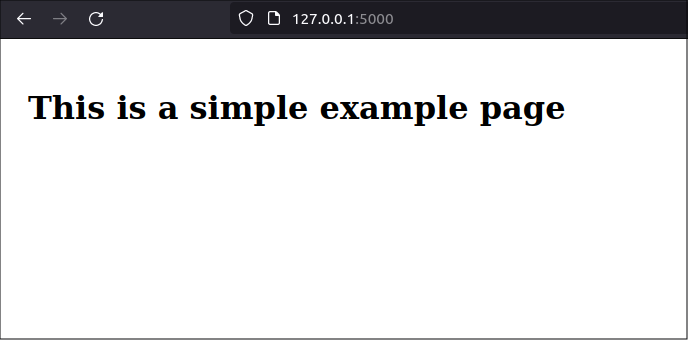
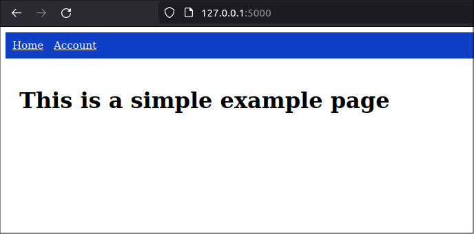
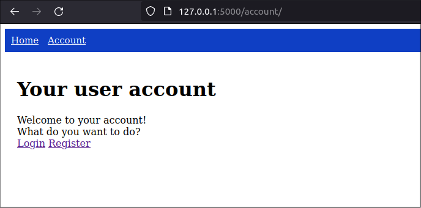
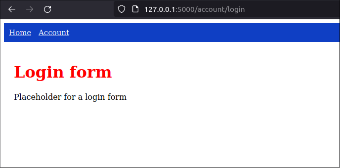
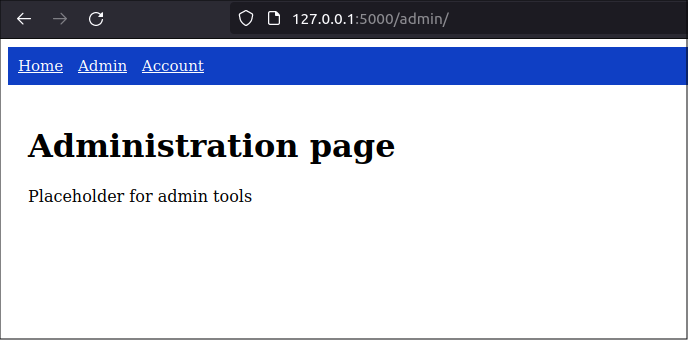
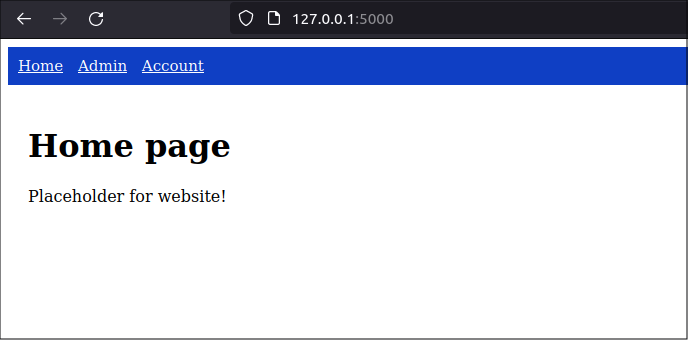

title: Use blueprints to organize a Flask application
slug: flask-blueprints-python
summary: I wrote this post to clearly describe the rules Flask follows when searching for template files in blueprint folders, and to provide concrete examples.
date: 2024-04-01
modified: 2024-04-01
category: Flask
status: Draft


<!--
A bit of extra CSS code to centre all images in the post
-->
<style>
img
{
    display:block; 
    float:none; 
    margin-left:auto;
    margin-right:auto;
}
</style>

I am starting a large Flask project so I needed to define the project structure. After some research and testing, I decided I will organize application code and resources into [Flask Blueprints](https://flask.palletsprojects.com/en/3.0.x/blueprints/). 

I wrote this post to clearly describe the rules Flask follows when searching for template files in blueprint folders, and to provide concrete examples. Flask searches for blueprint resources in template files using different rules than when it searches for static files. If you do not read the Flask documentation very carefully, you might end up getting confused. I want to save readers from experiencing the same aggravation I encountered when developing the view functions and template files in large Flask applications.

# Start with a small example

I structured this post like a tutorial that you can follow along with. I start with a small "toy" application similar to that which you may have seen in many other Flask tutorials. Then, I will add blueprints and additional functionality.

First, I created a project folder that contains a sub-folder with the application source code. The project folder also contains a *[dotenv](https://learningwithcode.com/use-environment-variables-python)* file that defines environment variable values used to configure the application, and a *requirements.txt* file.

The initial project structure is shown below:

```text
project
├── mfo
│   ├── static
│   │   └── css
│   │       └── styles.css
│   ├── templates
│   │   └── base.html
│   ├── app.py
│   └── config.py
├── .env
└── requirements.txt
```

The application is called *MFO* so the application folder is named *mfo*.

## The Flask application file

In this simple example, the Flask application file *app.py* creates the Flask app object, configures it, and defines a single view function. The file is listed below:

```python
# mfo/app.py

import flask


def create_app():

    # Create app object
    app = flask.Flask(__name__)

    # Configure the app
    app.config.from_pyfile('config.py')

    # Define a view function
    @app.route('/')
    def index():
        return flask.render_template('/index.html')
        
    return app
```

## The configuration files

Two files work together to provide some initial configuration to the Flask application: the *config.py* file and the *dotenv* file.

The *config.py* file reads environment variable values and uses them to define the [application configuration values](https://flask.palletsprojects.com/en/3.0.x/config/#builtin-configuration-values).

```python
# mfo/config.py

import os
import dotenv

dotenv.load_dotenv()

SECRET_KEY = os.environ.get("FLASK_SECRET_KEY")
ENVIRONMENT = os.environ.get("FLASK_ENVIRONMENT")
DEBUG = os.environ.get("FLASK_DEBUG")
EXPLAIN_TEMPLATE_LOADING = os.environ.get("FLASK_EXPLAIN_TEMPLATE_LOADING")
```

By default, the *dotenv.load_dotenv()* method looks for the *dotenv* file in the current working directory or any parent directories and sets the shell's environment variables with the values found in that file. If environment variables are already set in the shell, the *load_dotenv()* method will not overwrite them.

The *dotenv* file, *.env*, is stored in the project folder and is listed below: 

```python
# .env

FLASK_APP = app
FLASK_SECRET_KEY = abcdFakeKey1234

FLASK_ENVIRONMENT = development
FLASK_DEBUG = True
FLASK_EXPLAIN_TEMPLATE_LOADING = True
```

## The template file

Most Flask sites use a base template that defines the common look of the web site. Other templates will extend the base template to create specific web pages.

Create the base template, *project/mfo/templates/base.html* as listed below:

```html
<!-- mfo/templates/base.html -->

<!DOCTYPE html>
<html lang="en">
<head>
    <meta charset="UTF-8">
    <title>Example Website</title>
    <link rel="stylesheet" href="/static/css/styles.css" />
    
</head>

<body>
    <div class="content">
        
        
    </div>
</body>
</html>
```

Then, create an *index.html* template that contains the content to be displayed when the application calls the *index* view function.

```html
<!-- mfo/templates/index.html -->



Main App Index page page


    <h1>Main Index Page</h1>


```


## The CSS file

Flask applications store CSS files in the *static* folder. To demonstrate how blueprints use their own *static* folders, I created a small bit of CSS styling for the base template. The base CSS file is named *styles.css* and is stored in the *mfo/static/css* directory:

```css
/*  mfo/static/css/styles.css  */

.content {
    padding: 20px;
}

h1 {
    font-weight: bold;
    color: rgb(0, 0, 0);
    font-size: 32px;
  }
```

## Testing the application

To test this simple example, install the required packages and run the Flask program.

First, create a *requirements.txt* file in the project folder:

```
# requirements.txt

flask
python-dotenv
```

Then, create virtual environment in the project folder.

```text
$ python3 -m venv .venv
```

Finally, activate the virtual environment and install the requirements:

```
$ source venv/bin/activate
(venv) $ pip install -r requirements.txt
```

From the project folder, run the flask application:

```text
$ flask --app mfo.app run
```

Open a web browser and navigate to *http//:localhost:5000*. You will see that the app serves up the base template and that its HTML code is styled as defined by the base CSS file:



When you look at the terminal screen, you should see some output that shows how Flask searched for the *index.html* and *base.html* templates and the CSS file.

```text
[2024-04-28 16:24:40,270] INFO in debughelpers: Locating template '/index.html':
    1: trying loader of application 'mfo.app'
       class: jinja2.loaders.FileSystemLoader
       encoding: 'utf-8'
       followlinks: False
       searchpath:
         - /home/brian/project/mfo/templates
       -> found ('/home/brian/project/mfo/templates/index.html')
[2024-04-28 16:24:40,274] INFO in debughelpers: Locating template 'base.html':
    1: trying loader of application 'mfo.app'
       class: jinja2.loaders.FileSystemLoader
       encoding: 'utf-8'
       followlinks: False
       searchpath:
         - /home/brian/project/mfo/templates
       -> found ('/home/brian/project/mfo/templates/base.html')
127.0.0.1 - - [28/Apr/2024 16:24:40] "GET / HTTP/1.1" 200 -
127.0.0.1 - - [28/Apr/2024 16:24:40] "GET /static/css/styles.css HTTP/1.1" 200 -
```

No blueprints are defined yet so Flask has only one search path for template files. As you can see in the example above, the current search path is: *project/mfo/templates/*.

## Next steps

That was the basic scenario: Flask had only one folder in which it could look to find template files and one folder in which it could look to find static files like CSS files.

Next, we will move the view functions into Flask blueprint folders and register Flask blueprints. This will show how Flask finds template and static files in those folders.

# Create a Flask blueprint for the home page

Creating Flask blueprints is easy and is a great way to organize your application's view functions.

First, I want to move the view function in the *app.py* file into a blueprint so I can write all my view functions in other files. This way, the *app.py* file will exclusively contain application configuration code and all the application's actual functionality will be separated into easy-to-manage blueprints.

Note that the *home* blueprint is a special case. It contains the view functions used by the application's home page so we want the URL prefix to be the application's root folder instead of the blueprint folder. 

```text
$ pwd
/home/brian/project/mfo
$ mkdir home
```

Then create a file named *views.py* in the *home/* folder. 

```
$ nano home/views.py
```

Move the *index* view function from the *app.py* file to this new *views.py* file and declare it as a blueprint view function. In this special case, we do not need to define the blueprint's *templates* or *static* folder.:

```python
# mfo/home/views.py

import flask

bp = flask.Blueprint(
    'home',
    __name__,
    url_prefix='/',
    )

@bp.route('/')
def index():
    return flask.render_template('/index.html')
```

Then, change the *app.py* file. Remove the view function and replace it with the blueprint registration. Be sure to import the file containing the blueprint.

The new *app.py* file looks like the following:

```python
# mfo/app.py

import flask
import mfo.home.views

def create_app():

    # Create app object
    app = flask.Flask(__name__)

    # Configure the app
    app.config.from_pyfile('config.py')

    # Register blueprints
    app.register_blueprint(mfo.home.views.bp)

    return app
```

We did not need to create any template files for the home blueprint's *index.html* function because the blueprint's URL is the application's root folder so the existing *index.html* template in the *mfo/templates* folder will be used.

When testing the application now, it should appear to work the same as before. All we did was move the view function logic for home page routes to the *home* blueprint.

# Create an *accounts* page blueprint

I want to create a new page for "accounts". It will eventually support account functions like logging into a user acount, displaying user information if the user is logged in, and registering new users. For now, it will just be a dummy page with two links to a "login" dummy page and a "register" dummy page. 

I will implement this new page as a blueprint with its own view functions, templates, and static files.

In the *mfo* application folder, I created a new folder named *account*. In that folder, I created a blueprint file containing the blueprint definition and the routes supported by the blueprint. I also created new subfolders named *template* and *static*, which will contain the template files and CSS files that support the "accounts" page.

```
$ mkdir account
$ mkdir account/templates
$ mkdir -p account/static/css
```


The blueprint folder structure will look like below:

```text
mfo
├── account
│   ├── views.py
│   ├── static
│   │   └── css
│   │       └── styles.css
│   └── templates
│       └── account
│           ├── index.html
│           ├── login.html
│           └── register.html
...
```

I modified the main Flask application file, *app.py*, so it registered the new *account* blueprint. In addition, I changed the main template name to *shared_layout.html* because it will be a shared resource used by all the blueprint templates. It contains navigation links to the different site pages which are, at this point, the *home* page and the *account* page.

The remaining files in the application folder have the following structure, which is the same as the simple example I started with, except the template's file name is different:

```text
...
├── static
│   └── css
│       └── styles.css
├── templates
│   ├── base.html
│   └── index.html
├── app.py
└── config.py
```

## The blueprint file

```python
# account/views.py

import flask

bp = flask.Blueprint(
    'account',
    __name__,
    static_folder='static',
    template_folder='templates',
    url_prefix='/account',
    )

@bp.route('/')
def index():
    return flask.render_template('/account/index.html')

@bp.route('/login')
def login():
    return flask.render_template('/account/login.html')

@bp.route('/register')
def register():
    return flask.render_template('/account/register.html')
```

## Registering the blueprint

```python
# app.py

import flask

app = flask.Flask(__name__)
app.config.from_pyfile('config.py')

# Register blueprint
from mfo.account import account
app.register_blueprint(account.bp)

@app.route('/')
def index():
    return flask.render_template('/shared_layout.html')

if __name__ == "__main__":
    app.run()
```

## The blueprint static folder

I bundles a CSS file named *styles.css* with the *account* template to demonstrate how the blueprint finds its own bundled static files. The main application CSS file will color all *Heading1* tags black, along with other styles, but the CSS file in the *account* blueprint will change *Heading1* text to red. 

```css
/* account/static/css/styles.css */

h1 {
    color: rgb(255, 0, 0);
  }
```

Any template used by the *account* blueprint can add this additional CSS file and, in this example, the *login.html* template will add this CSS file. 

## The blueprint templates

I created templates for the three account pages: the main account page is *index.html*, the login page is *login.html*, and the registration page is *register.html*.

### The main account page template

```html
<!-- account/templates/account/index.html -->


User Information


    <div>
        <h1>Your user account</h1>

        <div>
            Welcome to your account!
        </div>
        <div>
            What do you want to do?
        </div>
        <div>
            <a href = "{{url_for('account.login')}}">Login</a>
            <a href = "{{url_for('account.register')}}">Register</a>
        </div>
    </div>



```

### The login page template

The *login.html* template adds an additional CSS file, which will extend or overwrite the CSS from the Flask application's main CSS file. This demonstrates how the blueprint finds its own bundled static files.

```html
<!-- account/templates/account/login.html -->


Login to your account


    <div>
        <h1>Login form</h1>

        <div>
            Placeholder for a login form
        </div>
    </div>



    <link rel="stylesheet" href="{{ url_for('account.static', filename='css/styles.css') }}" >

```

### The registration page template

```html
<!-- account/templates/account/register.html -->


Register a new user


    <div class="form-container">
        <h1>Register form</h1>

        <div>
            Placeholder for a user registration form
        </div>
    </div>



```

## The shared layout template

In the main application template, now named *shared_layout.html*, I added navigation links in a nav bar

```html
<!-- templates/shared_layout.html -->

<!DOCTYPE html>
<html lang="en">
<head>
    <meta charset="UTF-8">
    <title>Music Festival Website</title>
    <link rel="stylesheet" href="/static/css/styles.css" />
    
</head>

<body>
    <nav>
        <a href="/">Home</a>
        <a href="{{ url_for('account.index') }}">Account</a>
    </nav>

    <div class="main_content">
        
        <h1>This is a simple example page</h1>
        
    </div>
</body>
</html>
```

I also added some styles for the nav bar in the main CSS file, *static/css/styles.css*:

```css
/* static/css/styles.css */

.main_content {
    padding: 20px;
}

h1 {
    font-weight: bold;
    color: rgb(0, 0, 0);
    font-size: 32px;
  }

nav {
    background-color: rgb(15, 63, 196);
    padding: 10px;
    font-size: 15px;
    color: white;
}

nav > a {
    color: white;
    margin-right: 10px;
}
```

## testing the blueprint

Home page



```text
[2024-04-05 16:58:43,833] INFO in debughelpers: Locating template '/shared_layout.html':
    1: trying loader of application 'mfo.app'
       class: jinja2.loaders.FileSystemLoader
       encoding: 'utf-8'
       followlinks: False
       searchpath:
         - /home/brian/Projects/Music Festival Program/music-festival-organizer/mfo/templates
       -> found ('/home/brian/Projects/Music Festival Program/music-festival-organizer/mfo/templates/shared_layout.html')
    2: trying loader of blueprint 'account' (mfo.account.views)
       class: jinja2.loaders.FileSystemLoader
       encoding: 'utf-8'
       followlinks: False
       searchpath:
         - /home/brian/Projects/Music Festival Program/music-festival-organizer/mfo/account/templates
       -> no match
127.0.0.1 - - [05/Apr/2024 16:58:43] "GET / HTTP/1.1" 200 -
127.0.0.1 - - [05/Apr/2024 16:58:43] "GET /static/css/styles.css HTTP/1.1" 304 -
```

account page



```text
[2024-04-05 17:00:57,986] INFO in debughelpers: Locating template '/account/index.html':
    1: trying loader of application 'mfo.app'
       class: jinja2.loaders.FileSystemLoader
       encoding: 'utf-8'
       followlinks: False
       searchpath:
         - /home/brian/Projects/Music Festival Program/music-festival-organizer/mfo/templates
       -> no match
    2: trying loader of blueprint 'account' (mfo.account.views)
       class: jinja2.loaders.FileSystemLoader
       encoding: 'utf-8'
       followlinks: False
       searchpath:
         - /home/brian/Projects/Music Festival Program/music-festival-organizer/mfo/account/templates
       -> found ('/home/brian/Projects/Music Festival Program/music-festival-organizer/mfo/account/templates/account/index.html')
[2024-04-05 17:00:57,988] INFO in debughelpers: Locating template 'shared_layout.html':
    1: trying loader of application 'mfo.app'
       class: jinja2.loaders.FileSystemLoader
       encoding: 'utf-8'
       followlinks: False
       searchpath:
         - /home/brian/Projects/Music Festival Program/music-festival-organizer/mfo/templates
       -> found ('/home/brian/Projects/Music Festival Program/music-festival-organizer/mfo/templates/shared_layout.html')
    2: trying loader of blueprint 'account' (mfo.account.views)
       class: jinja2.loaders.FileSystemLoader
       encoding: 'utf-8'
       followlinks: False
       searchpath:
         - /home/brian/Projects/Music Festival Program/music-festival-organizer/mfo/account/templates
       -> no match
127.0.0.1 - - [05/Apr/2024 17:00:57] "GET /account/ HTTP/1.1" 200 -
127.0.0.1 - - [05/Apr/2024 17:00:58] "GET /static/css/styles.css HTTP/1.1" 304 -
```

login page



```text
[2024-04-05 17:02:11,243] INFO in debughelpers: Locating template '/account/login.html':
    1: trying loader of application 'mfo.app'
       class: jinja2.loaders.FileSystemLoader
       encoding: 'utf-8'
       followlinks: False
       searchpath:
         - /home/brian/Projects/Music Festival Program/music-festival-organizer/mfo/templates
       -> no match
    2: trying loader of blueprint 'account' (mfo.account.views)
       class: jinja2.loaders.FileSystemLoader
       encoding: 'utf-8'
       followlinks: False
       searchpath:
         - /home/brian/Projects/Music Festival Program/music-festival-organizer/mfo/account/templates
       -> found ('/home/brian/Projects/Music Festival Program/music-festival-organizer/mfo/account/templates/account/login.html')
127.0.0.1 - - [05/Apr/2024 17:02:11] "GET /account/login HTTP/1.1" 200 -
127.0.0.1 - - [05/Apr/2024 17:02:11] "GET /static/css/styles.css HTTP/1.1" 304 -
127.0.0.1 - - [05/Apr/2024 17:02:11] "GET /account/static/css/styles.css HTTP/1.1" 304 -
```

# Creating more blueprints

This is where we could run into namespace issues for tempaltes

Add an *admin* blueprint for an admin page and move the route for the home page to a *home* blueprint. The structure of the addition folders is:

```text
...
├── admin
│   ├── views.py
│   ├── static
│   │   └── css
│   └── templates
│       └── admin
│           └── index.html
├── home
│   ├── views.py
│   ├── static
│   │   └── css
│   └── templates
│       └── home
│           └── index.html
...
```

## The *admin* view file

```python
# app.py

import flask

app = flask.Flask(__name__)
app.config.from_pyfile('config.py')

# Register blueprints
import mfo.account.views
import mfo.admin.views
import mfo.home.views
app.register_blueprint(mfo.account.views.bp)
app.register_blueprint(mfo.admin.views.bp)
app.register_blueprint(mfo.home.views.bp)

if __name__ == "__main__":
    app.run()
```

## The *admin* template

```html
<!-- admin/templates/admin/index.html -->


Admin page


    <div>
        <h1>Administration page</h1>

        <div>
            Placeholder for admin tools
        </div>
    </div>



```

## The *home* view file

```python
# home/views.py

import flask

bp = flask.Blueprint(
    'home',
    __name__,
    static_folder='static',
    template_folder='templates',
    url_prefix='/',
    )

@bp.route('/')
def index():
    return flask.render_template('/home/index.html')
```

## The *home* template

```html
<!-- home/templates/home/index.html -->


Home page


    <div>
        <h1>Home page</h1>

        <div>
            Placeholder for website!
        </div>
    </div>



```

## The updated *app.py* file

Removed the original "/" route because it is now in the *home* blueprint. Registered the *admin* and *home* blueprints

```python
# app.py

import flask

app = flask.Flask(__name__)
app.config.from_pyfile('config.py')

# Register blueprints
import mfo.account.views
import mfo.admin.views
import mfo.home.views
app.register_blueprint(mfo.account.views.bp)
app.register_blueprint(mfo.admin.views.bp)
app.register_blueprint(mfo.home.views.bp)

if __name__ == "__main__":
    app.run()
```

Now, the *app.py* file contains no routes or view functions. It simply configures the Flask app object with configuration variables and blueprints.

Currently, all program logic is in the blueprint folders. When I add a database or otehr common components, I may have to place program logic in other folders that are 

## Testing new pages

Admin page



```text
[2024-04-05 18:05:59,994] INFO in debughelpers: Locating template '/admin/index.html':
    1: trying loader of application 'mfo.app'
       class: jinja2.loaders.FileSystemLoader
       encoding: 'utf-8'
       followlinks: False
       searchpath:
         - /home/brian/Projects/Music Festival Program/music-festival-organizer/mfo/templates
       -> no match
    2: trying loader of blueprint 'account' (mfo.account.views)
       class: jinja2.loaders.FileSystemLoader
       encoding: 'utf-8'
       followlinks: False
       searchpath:
         - /home/brian/Projects/Music Festival Program/music-festival-organizer/mfo/account/templates
       -> no match
    3: trying loader of blueprint 'admin' (mfo.admin.views)
       class: jinja2.loaders.FileSystemLoader
       encoding: 'utf-8'
       followlinks: False
       searchpath:
         - /home/brian/Projects/Music Festival Program/music-festival-organizer/mfo/admin/templates
       -> found ('/home/brian/Projects/Music Festival Program/music-festival-organizer/mfo/admin/templates/admin/index.html')
    4: trying loader of blueprint 'home' (mfo.home.views)
       class: jinja2.loaders.FileSystemLoader
       encoding: 'utf-8'
       followlinks: False
       searchpath:
         - /home/brian/Projects/Music Festival Program/music-festival-organizer/mfo/home/templates
       -> no match
[2024-04-05 18:06:00,000] INFO in debughelpers: Locating template 'shared_layout.html':
    1: trying loader of application 'mfo.app'
       class: jinja2.loaders.FileSystemLoader
       encoding: 'utf-8'
       followlinks: False
       searchpath:
         - /home/brian/Projects/Music Festival Program/music-festival-organizer/mfo/templates
       -> found ('/home/brian/Projects/Music Festival Program/music-festival-organizer/mfo/templates/shared_layout.html')
    2: trying loader of blueprint 'account' (mfo.account.views)
       class: jinja2.loaders.FileSystemLoader
       encoding: 'utf-8'
       followlinks: False
       searchpath:
         - /home/brian/Projects/Music Festival Program/music-festival-organizer/mfo/account/templates
       -> no match
    3: trying loader of blueprint 'admin' (mfo.admin.views)
       class: jinja2.loaders.FileSystemLoader
       encoding: 'utf-8'
       followlinks: False
       searchpath:
         - /home/brian/Projects/Music Festival Program/music-festival-organizer/mfo/admin/templates
       -> no match
    4: trying loader of blueprint 'home' (mfo.home.views)
       class: jinja2.loaders.FileSystemLoader
       encoding: 'utf-8'
       followlinks: False
       searchpath:
         - /home/brian/Projects/Music Festival Program/music-festival-organizer/mfo/home/templates
       -> no match
127.0.0.1 - - [05/Apr/2024 18:06:00] "GET /admin/ HTTP/1.1" 200 -
127.0.0.1 - - [05/Apr/2024 18:06:00] "GET /static/css/styles.css HTTP/1.1" 304 -
```

Home page



```text
[2024-04-05 18:09:46,863] INFO in debughelpers: Locating template '/home/index.html':
    1: trying loader of application 'mfo.app'
       class: jinja2.loaders.FileSystemLoader
       encoding: 'utf-8'
       followlinks: False
       searchpath:
         - /home/brian/Projects/Music Festival Program/music-festival-organizer/mfo/templates
       -> no match
    2: trying loader of blueprint 'account' (mfo.account.views)
       class: jinja2.loaders.FileSystemLoader
       encoding: 'utf-8'
       followlinks: False
       searchpath:
         - /home/brian/Projects/Music Festival Program/music-festival-organizer/mfo/account/templates
       -> no match
    3: trying loader of blueprint 'admin' (mfo.admin.views)
       class: jinja2.loaders.FileSystemLoader
       encoding: 'utf-8'
       followlinks: False
       searchpath:
         - /home/brian/Projects/Music Festival Program/music-festival-organizer/mfo/admin/templates
       -> no match
    4: trying loader of blueprint 'home' (mfo.home.views)
       class: jinja2.loaders.FileSystemLoader
       encoding: 'utf-8'
       followlinks: False
       searchpath:
         - /home/brian/Projects/Music Festival Program/music-festival-organizer/mfo/home/templates
       -> found ('/home/brian/Projects/Music Festival Program/music-festival-organizer/mfo/home/templates/home/index.html')
127.0.0.1 - - [05/Apr/2024 18:09:46] "GET / HTTP/1.1" 200 -
127.0.0.1 - - [05/Apr/2024 18:09:46] "GET /static/css/styles.css HTTP/1.1" 304 -
```

# Templates in Flask blueprint folders

The flask blueprint enables you to specify the folder in which all your static files will be found and it only looks in that folder. It does not search for other static files in other namespaces.

But, templates work differently. The Flask developers wanted you to be able to "override" one template file with another of the same name if you wanted to.

This is why you need to use the naming convention we use with the seemingly unneccessary template folder structure. You need a unique string to identify the template if you are using generic filenames like *index.html*. So */account/index.html* is unique.

Setting the template folder in the blueprint definition to *templates/account* and then referencing the template with only the filename *index.html* will not work. Flask will look for *index.html* in every other blueprint's template folder and in the main application templates folder and will use the first on that was registered

https://realpython.com/flask-blueprint/#including-templates


# Final app structure   

The final project structure is shown below. this supports navigating between blueprints and is a good base upon which to buid the rest of my application.

```text
project
├── requirements.txt
└── mfo
    ├── account
    │   ├── static
    │   │   └── css
    │   │       └── styles.css
    │   ├── templates
    │   │   └── account
    │   │       ├── index.html
    │   │       ├── login.html
    │   │       └── register.html
    │   └── views.py
    |
    ├── admin
    │   ├── static
    │   │   └── css
    │   ├── templates
    │   │   └── admin
    │   │       └── index.html
    │   └── views.py
    |
    ├── home
    │   ├── static
    │   │   └── css
    │   ├── templates
    │   │   └── home
    │   │       └── index.html
    │   └── views.py
    |
    ├── app.py
    ├── config.py
    ├── .env
    ├── requirements.txt
    ├── static
    │   └── css
    │       └── styles.css
    └── templates
        └── shared_layout.html
```


# Project structure

Below, I outline the folders and files that will support my Flask application. I decided that each page presented by the application will have its own blueprint and each blueprint will be fully self-contained with its own resource files.

The high-level folder structure looks like below. In the application's root folder, I have the main flask app named *app.py*, a config file named *config.py* and the standard Flask resource folders, *static* and *templates*. Then, I have three blueprint folders named *account*, *admin*, and *home*. 

```text
mfo
├── account/
├── admin/
├── home/
│
├── static/
├── templates/
│
├── app.py
└── config.py
```

Each blueprint folder will have its own view functions and its own *templates* and *static* sub-folders.

## Why not create packages?

The Flask documentation [recommends implementing large applications as packages](https://flask.palletsprojects.com/en/3.0.x/patterns/packages/). I may do that later but, for now, I will implement the application as a set of modules. I think this makes it easier to understand the structure of the project. See the [official Flask tutorial](https://flask.palletsprojects.com/en/3.0.x/tutorial/layout/) for an example of implementing a Flask app as a package. 

Also, see my [previous post about packaging Python applications](https://learningwithcode.com/python-packaging-modern) if you need more information about packaging.

## Why this structure?

After [learning the basics of Flask]([previous](https://learningwithcode.com/flask-web-app-tutorial)), I wanted to create a program structure that followed the generally-accepted practices of Flask application organization. So, I am using the [blueprint structure recommended in the Flask documentation](https://flask.palletsprojects.com/en/3.0.x/blueprints/). I prefer to keep all code related to each blueprint in the same blueprint folder.

There are some alternative application structures one could consider. These organize the blueprint view files all in one folder and have common *templates* and *static* folders for the entire application. See the [DigitalOcean Flask blueprint tutorial](https://www.digitalocean.com/community/tutorials/how-to-structure-a-large-flask-application-with-flask-blueprints-and-flask-sqlalchemy) for an example. 


And, now, I want to create a template for the *home* blueprint. This template file will also be named *index.html* but it will be in the *home* blueprint's *templates* folder.

```
$ nano home/templates/index.html
```

The new template will contain some different text from the main application's *index.html* template, so you will know if the application is finding the correct template:

```html
<!-- mfo/home/templates/index.html -->



Home page


    <h1>Home page</h1>

```

And, for the sake of this example, we'll add a new CSS file 

```
$ nano home/static/css/styles.css
```

The file will change the blueprint's heading text color to red:

```css
/*  mfo/home/static/css/styles.css  */

h1 {
    color: rgb(255, 0, 0);
  }
```

When you run the Flask application again, and navigate to *http://localhost:5000* in your web browser, you see that the application is still serving the main index template, and not the blueprint template. Look at the terminal to see the path that Flask is searching.

```
[2024-04-28 20:44:28,726] INFO in debughelpers: Locating template '/index.html':
    1: trying loader of application 'mfo.app'
       class: jinja2.loaders.FileSystemLoader
       encoding: 'utf-8'
       followlinks: False
       searchpath:
         - /home/brian/project/mfo/templates
       -> found ('/home/brian/project/mfo/templates/index.html')
    2: trying loader of blueprint 'home' (mfo.home.views)
       class: jinja2.loaders.FileSystemLoader
       encoding: 'utf-8'
       followlinks: False
       searchpath:
         - /home/brian/project/mfo/home/templates
       -> found ('/home/brian/project/mfo/home/templates/index.html')
Warning: multiple loaders returned a match for the template.
  The template was looked up from an endpoint that belongs to the blueprint 'home'.
  Maybe you did not place a template in the right folder?
  See https://flask.palletsprojects.com/blueprints/#templates
[2024-04-28 20:44:28,729] INFO in debughelpers: Locating template 'base.html':
    1: trying loader of application 'mfo.app'
       class: jinja2.loaders.FileSystemLoader
       encoding: 'utf-8'
       followlinks: False
       searchpath:
         - /home/brian/project/mfo/templates
       -> found ('/home/brian/project/mfo/templates/base.html')
    2: trying loader of blueprint 'home' (mfo.home.views)
       class: jinja2.loaders.FileSystemLoader
       encoding: 'utf-8'
       followlinks: False
       searchpath:
         - /home/brian/project/mfo/home/templates
       -> no match
127.0.0.1 - - [28/Apr/2024 20:44:28] "GET / HTTP/1.1" 200 -
127.0.0.1 - - [28/Apr/2024 20:44:28] "GET /static/css/styles.css HTTP/1.1" 304 -
```

You should see that Flask finds an *index.html* template twice. It finds it in the main application's template's folder at */home/brian/project/mfo/templates*, and in the *home* blueprint's templates folder at */home/brian/project/mfo/home/templates*. It uses the first template with the same name that it finds.

The Flask developers wanted you to be able to "override" one template file with another of the same name if you wanted to. Flask wiAnd, now, I want to create a template for the *home* blueprint. This template file will also be named *index.html* but it will be in the *home* blueprint's *templates* folder.

```
$ nano home/templates/index.html
```

The new template will contain some different text from the main application's *index.html* template, so you will know if the application is finding the correct template:

```html
<!-- mfo/home/templates/index.html -->



Home page


    <h1>Home page</h1>

```

And, for the sake of this example, we'll add a new CSS file 

```
$ nano home/static/css/styles.css
```

The file will change the blueprint's heading text color to red:

```css
/*  mfo/home/static/css/styles.css  */

h1 {
    color: rgb(255, 0, 0);
  }
```

When you run the Flask application again, and navigate to *http://localhost:5000* in your web browser, you see that the application is still serving the main index template, and not the blueprint template. Look at the terminal to see the path that Flask is searching.

```
[2024-04-28 20:44:28,726] INFO in debughelpers: Locating template '/index.html':
    1: trying loader of application 'mfo.app'
       class: jinja2.loaders.FileSystemLoader
       encoding: 'utf-8'
       followlinks: False
       searchpath:
         - /home/brian/project/mfo/templates
       -> found ('/home/brian/project/mfo/templates/index.html')
    2: trying loader of blueprint 'home' (mfo.home.views)
       class: jinja2.loaders.FileSystemLoader
       encoding: 'utf-8'
       followlinks: False
       searchpath:
         - /home/brian/project/mfo/home/templates
       -> found ('/home/brian/project/mfo/home/templates/index.html')
Warning: multiple loaders returned a match for the template.
  The template was looked up from an endpoint that belongs to the blueprint 'home'.
  Maybe you did not place a template in the right folder?
  See https://flask.palletsprojects.com/blueprints/#templates
[2024-04-28 20:44:28,729] INFO in debughelpers: Locating template 'base.html':
    1: trying loader of application 'mfo.app'
       class: jinja2.loaders.FileSystemLoader
       encoding: 'utf-8'
       followlinks: False
       searchpath:
         - /home/brian/project/mfo/templates
       -> found ('/home/brian/project/mfo/templates/base.html')
    2: trying loader of blueprint 'home' (mfo.home.views)
       class: jinja2.loaders.FileSystemLoader
       encoding: 'utf-8'
       followlinks: False
       searchpath:
         - /home/brian/project/mfo/home/templates
       -> no match
127.0.0.1 - - [28/Apr/2024 20:44:28] "GET / HTTP/1.1" 200 -
127.0.0.1 - - [28/Apr/2024 20:44:28] "GET /static/css/styles.css HTTP/1.1" 304 -
```

You should see that Flask finds an *index.html* template twice. It finds it in the main application's template's folder at */home/brian/project/mfo/templates*, and in the *home* blueprint's templates folder at */home/brian/project/mfo/home/templates*. It uses the first template with the same name that it finds.

The Flask developers wanted you to be able to "override" one template file with another of the same name if you wanted to. Flask will look for *index.html* in every blueprint's templates folder and in the main application templates folder and will use the first on that was registered

But, I want to keep blueprints self-contained in a folder with their own view functions and resources, I don't want to have to give every file a unique name.

Another way to solve this problem, which is the way recommended by the Flask documentation, is to add a folder in the blueprint's templates folder that creates a unique namespace for the template files. For example, templates in the *home* template folder would be placed in the *home/templates/home* folder instead of the *home/templates* folder and then regerenced by a unique name like *home/index.html*.

So, create the seemingly-redundant *home/templates/home* folder and move the *home* blueprint's *index.html* template file into it:

```
$ mkdir home/templates/home
$ mv home/templates/index.html home/templates/home/
```

Then, change the *views.py* file to the new, unique template namespace:

```

```


```
[2024-04-28 16:58:50,350] INFO in debughelpers: Locating template '/index.html':
    1: trying loader of application 'mfo.app'
       class: jinja2.loaders.FileSystemLoader
       encoding: 'utf-8'
       followlinks: False
       searchpath:
         - /home/brian/project/mfo/templates
       -> found ('/home/brian/project/mfo/templates/index.html')
    2: trying loader of blueprint 'home' (mfo.home.views)
       class: jinja2.loaders.FileSystemLoader
       encoding: 'utf-8'
       followlinks: False
       searchpath:
         - /home/brian/project/mfo/home/templates
       -> no match
[2024-04-28 16:58:50,354] INFO in debughelpers: Locating template 'base.html':
    1: trying loader of application 'mfo.app'
       class: jinja2.loaders.FileSystemLoader
       encoding: 'utf-8'
       followlinks: False
       searchpath:
         - /home/brian/project/mfo/templates
       -> found ('/home/brian/project/mfo/templates/base.html')
    2: trying loader of blueprint 'home' (mfo.home.views)
       class: jinja2.loaders.FileSystemLoader
       encoding: 'utf-8'
       followlinks: False
       searchpath:
         - /home/brian/project/mfo/home/templates
       -> no match
127.0.0.1 - - [28/Apr/2024 16:58:50] "GET / HTTP/1.1" 200 -
127.0.0.1 - - [28/Apr/2024 16:58:50] "GET /static/css/styles.css HTTP/1.1" 304 -
```
the main application templates folder and will use the first on that was registered

But, I want to keep blueprints self-contained in a folder with their own view functions and resources, I don't want to have to give every file a unique name.

Another way to solve this problem, which is the way recommended by the Flask documentation, is to add a folder in the blueprint's templates folder that creates a unique namespace for the template files. For example, templates in the *home* template folder would be placed in the *home/templates/home* folder instead of the *home/templates* folder and then regerenced by a unique name like *home/index.html*.

So, create the seemingly-redundant *home/templates/home* folder and move the *home* blueprint's *index.html* template file into it:

```
$ mkdir home/templates/home
$ mv home/templates/index.html home/templates/home/
```

Then, change the *views.py* file to the new, unique template namespace:

```

```


```
[2024-04-28 16:58:50,350] INFO in debughelpers: Locating template '/index.html':
    1: trying loader of application 'mfo.app'
       class: jinja2.loaders.FileSystemLoader
       encoding: 'utf-8'
       followlinks: False
       searchpath:
         - /home/brian/project/mfo/templates
       -> found ('/home/brian/project/mfo/templates/index.html')
    2: trying loader of blueprint 'home' (mfo.home.views)
       class: jinja2.loaders.FileSystemLoader
       encoding: 'utf-8'
       followlinks: False
       searchpath:
         - /home/brian/project/mfo/home/templates
       -> no match
[2024-04-28 16:58:50,354] INFO in debughelpers: Locating template 'base.html':
    1: trying loader of application 'mfo.app'
       class: jinja2.loaders.FileSystemLoader
       encoding: 'utf-8'
       followlinks: False
       searchpath:
         - /home/brian/project/mfo/templates
       -> found ('/home/brian/project/mfo/templates/base.html')
    2: trying loader of blueprint 'home' (mfo.home.views)
       class: jinja2.loaders.FileSystemLoader
       encoding: 'utf-8'
       followlinks: False
       searchpath:
         - /home/brian/project/mfo/home/templates
       -> no match
127.0.0.1 - - [28/Apr/2024 16:58:50] "GET / HTTP/1.1" 200 -
127.0.0.1 - - [28/Apr/2024 16:58:50] "GET /static/css/styles.css HTTP/1.1" 304 -
```
