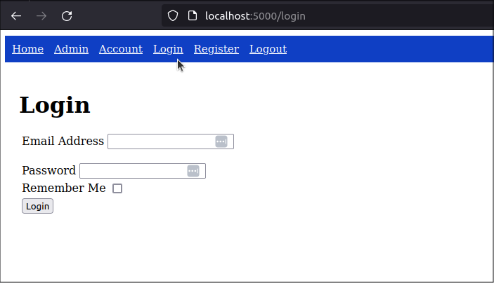
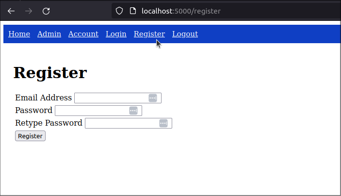
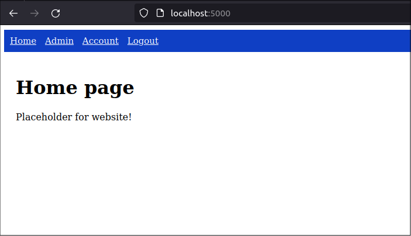
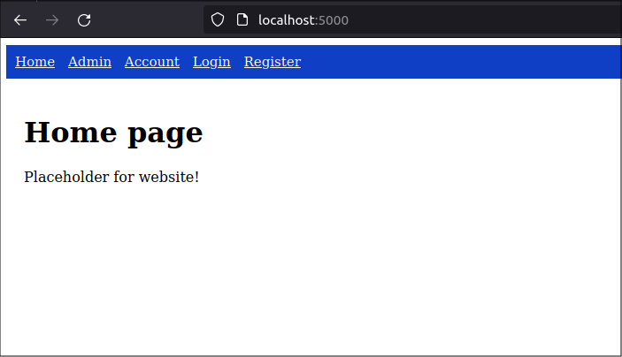

title: Customize Flask-Security-Too templates on your web site
slug: flask-security-customization
summary: As I continue to develop my web-app, I need to customize the templates used by the Flask-Security-Too extension. In this post, I will customize the login and register templates so they extend my shared website template and create a nav-bar that helps users understand if they are logged in and what permissions they have.
date: 2024-04-30
modified: 2024-04-30
category: Flask
status: Draft

<!--
A bit of extra CSS code to centre all images in the post
-->
<style>
img
{
    display:block; 
    float:none; 
    margin-left:auto;
    margin-right:auto;
    width:80%;
}
</style>


get tagged starting point (.002)

```
$ wget https://github.com/blinklet/music-festival-organizer/archive/refs/tags/0.002.zip
$ unzip 0.002.zip
$ $ ls -1
0.002.zip
music-festival-organizer-0.002
$ cd music-festival-organizer-0.002
$ ls -1
docs
LICENSE.txt
mfo
README.md
requirements.txt
```

Create and activare the Python virtual environment, then install the required packages

```text
$ python3 -m venv .venv
$ source .venv/bin/activate
(.venv) $ pip install -r requirements.txt
```

Set up the configuration variables for development in a new file named *.env*. Look at the file *mfo/dotenv_example* for instructions.

```text
$ nano mfo/.env
```

The contents of the file will be something like below:

```python
# Application variables
# ---------------------
FLASK_ENVIRONMENT = development
FLASK_APP = app
FLASK_DEBUG = True
FLASK_SECRET_KEY = LGBoUEDCCpgwxy5jZxpu9e01MTnRVqnG6A8ceD7Z4YU
FLASK_EXPLAIN_TEMPLATE_LOADING = True

# Flask-SQLAlchemy variables
# --------------------------
SQLALCHEMY_DATABASE_URI = ""
SQLALCHEMY_ECHO = True

# Flask-Security variables
# ---------------------
SECURITY_PASSWORD_SALT  = 307680677384259925768439955171685999662
```

Save the file and quit the editor.

Run the existing program to see how it works

```text
$ flask --app mfo.app run
```


If you click on the *Login* link in the navbar, you see that the Login page does not have the same look as the rest of the site. The navbar is missing.


The plan is to customize the templates used by Flask-Security-Too. 


## Find routes

Flask-Security-Too supports a lot of functionality and may support many roiutes if configured to do so. I am using a minimal configuration (see the config.py file for the configuration parameters) so I want to determine which Flask-Security_too routes are currently supported. And easy way to do this is to use the Flask CLI.

Flask-Security-Too will have registered functionality with the Flask CLI. See which Flask commands are suppported in teh Flask CLI

First, quit the running app with the *CTRL-C* key combination. Then, run the `flask --help` command to see the options available. Remember to specify the app name if you run the command outside the application's directory

```text
$ flask --app mfo.app --help

Usage: flask [OPTIONS] COMMAND [ARGS]...

  A general utility script for Flask applications.

  An application to load must be given with the '--app' option, 'FLASK_APP'
  environment variable, or with a 'wsgi.py' or 'app.py' file in the current
  directory.

Options:
  -e, --env-file FILE   Load environment variables from this file. python-
                        dotenv must be installed.
  -A, --app IMPORT      The Flask application or factory function to load, in
                        the form 'module:name'. Module can be a dotted import
                        or file path. Name is not required if it is 'app',
                        'application', 'create_app', or 'make_app', and can be
                        'name(args)' to pass arguments.
  --debug / --no-debug  Set debug mode.
  --version             Show the Flask version.
  --help                Show this message and exit.

Commands:
  roles   Role commands.
  routes  Show the routes for the app.
  run     Run a development server.
  shell   Run a shell in the app context.
  users   User commands.
```

At the end of the help information, you see the CLI commands avaiable. To show the routes available, run the *routes* command, as shown below:

```
$ flask --app mfo.app routes

Endpoint           Methods    Rule                           
-----------------  ---------  -------------------------------
account.index      GET        /account/                      
account.login      GET        /account/login                 
account.register   GET        /account/register              
account.static     GET        /account/static/<path:filename>
admin.index        GET        /admin/                        
admin.static       GET        /admin/static/<path:filename>  
home.index         GET        /                              
home.static        GET        /static/<path:filename>        
security.login     GET, POST  /login                         
security.logout    GET, POST  /logout                        
security.register  GET, POST  /register                      
security.static    GET        /fs-static/<path:filename>     
security.verify    GET, POST  /verify                        
static             GET        /static/<path:filename>    
```

So, I see the that the routes for *login* and *register* will need custom templates. the other security routs like *logout* and *verify* just forward to other pages so I don't need to customize templates for them.

## Override templates

According to the Flask-Security-Too documentation, [customize security templates](https://flask-security-too.readthedocs.io/en/stable/customizing.html#customizing) by creating a folder named *security* within the application’s *templates* folder and then creating a template with the same name as the template you wish to override. 

I copied the existing *login_user.html* and *register_user.html* templates from their current location, installed in the virtual environment folder, to the new folder and then modified it. (You can also download the templates from the *Flask-Security-Too* GitHub repo)

```text
$ cd mfo/templates
$ mkdir security
$ cp ../../.venv/lib/python3.10/site-packages/flask_security/templates/security/login_user.html security/
$ cp ../../.venv/lib/python3.10/site-packages/flask_security/templates/security/register_user.html security/
$ ls -1 security/
login_user.html
register_user.html
```


There are a lot of styles defined in the *security/base.html* template. I will leave them as-is in case they are compatible with Bootstrap, which I intend to use later. I moved them to my main CSS file in *mfo/static/css/styles.css*

```
/* static/css/styles.css */

.main_content {
    padding: 20px;
}

h1 {
    font-weight: bold;
    color: rgb(0, 0, 0);
    font-size: 32px;
  }

nav {
    background-color: rgb(15, 63, 196);
    padding: 10px;
    font-size: 15px;
    color: white;
}

nav > a {
    color: white;
    margin-right: 10px;
}

/* Coped from security/templates/security/base.html */
.fs-center { text-align: center }
.fs-important { font-size: larger; font-weight: bold }
.fs-gap { margin-top: 20px; }
.fs-div { margin: 4px; }
.fs-error-msg { color: darkred; }
```

### User_login template

the changes I made were:

* Change the base template to use the *shared_layout.html* tempate in my application
* Remove the security menu near the end of the template, because it is redundant now that the *Login* and *Register* links are in the navbar.
* Changed the *content* block name to *main_content* to match the *shared_layout.html* template

The new template looks like below:

```html




  
  <h1>{{ _fsdomain('Login') }}</h1>
  <form action="{{ url_for_security('login') }}{{ prop_next() }}" method="post" name="login_user_form">
    {{ login_user_form.hidden_tag() }}
    {{ render_form_errors(login_user_form) }}
    {{ render_field_with_errors(login_user_form.email) }}
    
      <h3>{{ _fsdomain("or") }}</h3>
      {{ render_field_with_errors(login_user_form.username) }}
    
    <div class="fs-gap">{{ render_field_with_errors(login_user_form.password) }}</div>
    {{ render_field_with_errors(login_user_form.remember) }}
    {{ render_field_errors(login_user_form.csrf_token) }}
    {{ render_field(login_user_form.submit) }}
  </form>
  
    <hr class="fs-gap">
    <h2>{{ _fsdomain("Use WebAuthn to Sign In") }}</h2>
    <div>
      <form method="get" id="wan_signin_form" name="wan_signin_form">
        <input id="wan_signin" name="wan_signin" type="submit" value="{{ _fsdomain('Sign in with WebAuthn') }}" formaction="{{ url_for_security('wan_signin') }}{{ prop_next() }}">
      </form>
    </div>
  
  
    <hr class="fs-gap">
    <h2>{{ _fsdomain("Use Social Oauth to Sign In") }}</h2>
    
      <div class="fs-gap">
        <form method="post" id="{{ provider }}_form" name="{{ provider }}_form">
          <input id="{{ provider }}" name="{{ provider }}" type="submit" value="{{ _fsdomain('Sign in with ')~provider }}" formaction="{{ url_for_security('oauthstart', name=provider) }}{{ prop_next() }}">
          
            <input id="{{ provider }}_csrf_token" name="{{ provider }}_csrf_token" type="hidden" value="{{ csrf_token() }}">
          
        </form>
      </div>
    
  

```

### Register template

I made similar changes to the *register_user.html* template

```html




  
  <h1>{{ _fsdomain('Register') }}</h1>
  <form action="{{ url_for_security('register') }}" method="post" name="register_user_form">
    {{ register_user_form.hidden_tag() }}
    {{ render_form_errors(register_user_form) }}
    {{ render_field_with_errors(register_user_form.email) }}
    {{ render_field_with_errors(register_user_form.username) }}
    {{ render_field_with_errors(register_user_form.password) }}
    
      {{ render_field_with_errors(register_user_form.password_confirm) }}
    
    {{ render_field_errors(register_user_form.csrf_token) }}
    {{ render_field(register_user_form.submit) }}
  </form>

```

## Check results

Now run the app again or refresh the browser if it is still running. The *Login* window will look like below:



The *Register* page will look like below



They both look better and use the common styles and formatting provided by the *shared_layout.html* template.

# Dynamic navbar

Configure the navbar to display links depending on login status

* If user logged in, show *Logout* link, but do not show *Login* or *Register* links
* If no user logged in, show *Login* and *Register* links, but do not show *Logout* link

Use the [*_fs_is_user_authenticated* function](https://flask-security-too.readthedocs.io/en/stable/customizing.html#views) that Flask-Security-Too provides to templates.

I used some Jinja2 *if* statements in the navbar section of the *shared_layout.html* template. That section was chanhes as shown below:

```html
<nav>
    <a href="/">Home</a>
    <a href="{{ url_for('admin.index') }}">Admin</a>
    <a href="{{ url_for('account.index') }}">Account</a>

    
    <a href="{{ url_for_security('login') }}">Login</a>
    <a href="{{ url_for_security('register') }}">Register</a>
    

    
    <a href="{{ url_for_security('logout') }}">Logout</a>
    
</nav>
```

This simple change makes the links appear in the navbar only when they are needed.

When a user is logged in, the navbar looks like below:



When the user logs out, the navbar looks like below:




# App structure

See that we added the custom templates in the main application's *templates* directory. I show just the directories we modified in the tree list below.

```text
mfo
|
...
├── static
│   └──  css
│       └── styles.css
│
└── templates
    ├── security
    │   ├── login_user.html
    │   └── register_user.html
    └── shared_layout.html
```


test
show that the login screen loses my nav bar and formtting
fix by customizing templates
show the security templates in Github or in the venv folder

show database content
show the user and roles classes in Github or in the venv folder


Default account routes used by Flask-Security-Too are /login and /register. So my old system with an *account* blueprint using /account/login and /account/register will not work.

I could maybe try to "overload" parts of the *security* blueprint by creating and registering my own security blueprint, or I could configure settings like SECURITY_LOGIN_URL (https://flask-security-too.readthedocs.io/en/stable/configuration.html) so the routes appear where I want them but, let's keep things simple and let Flask-Security-Too do what it wants, for now. I will remove the *account* route from my program and use the routes provided by Flask-Security-Too

I changed the *home* blueprint so it has link that allow users to login and register.
Also, the /templates/shared_layout.html -- changed the nav links


To override the templates used by Flask-Security: https://flask-security-too.readthedocs.io/en/stable/customizing.html

1) Go to Flask-Security-Too Git repo
2) Copy the login template (https://github.com/Flask-Middleware/flask-security/blob/master/flask_security/templates/security/login_user.html)
3) Create a folder named security within my app's templates folder
4) Create a template with the same name for the template you wish to override
  a) In this case: /templates/security/login_user.html


see:
https://flask-security-too.readthedocs.io/en/stable/quickstart.html#basic-sqlalchemy-application
https://github.com/hrishikeshrt/flask-bootstrap-anywhere/tree/master

https://blog.teclado.com/user-authentication-flask-security-too/
https://blog.teclado.com/customise-pages-emails-flask-security-too/
https://blog.teclado.com/email-confirmation-flask-security-too/


https://jinja.palletsprojects.com/en/3.0.x/tricks/   explains the "set active_page" variable in flask-bootstrap-anywhere templates
Useful for highlighting active page in nav bar