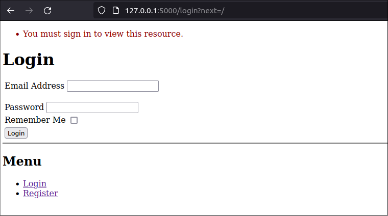
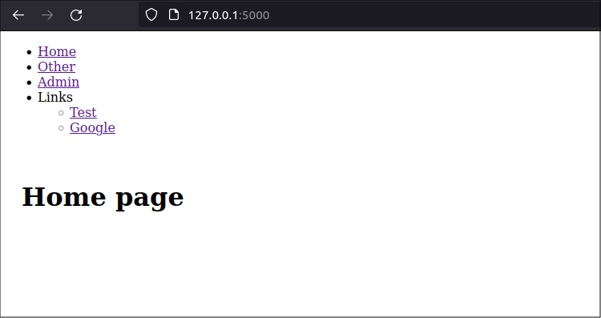
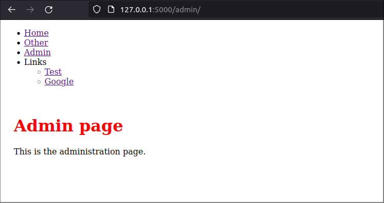
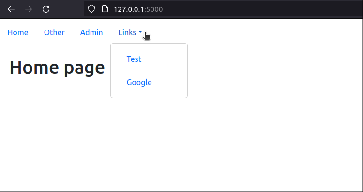
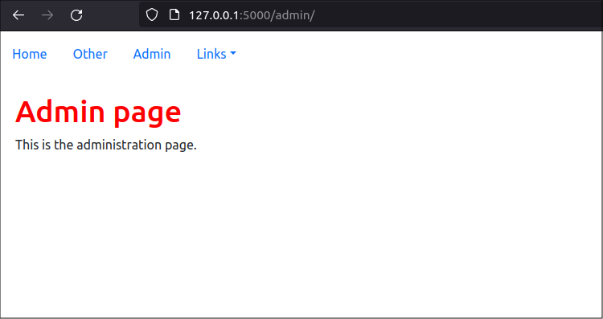
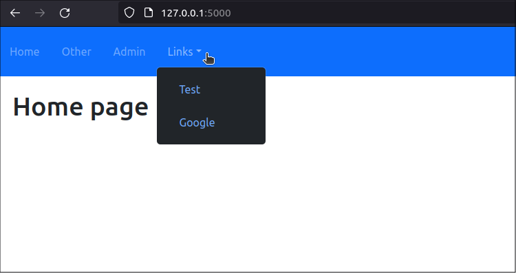

title: Add a navigation bar to your Flask web app
slug: python-flask-navbar
summary: How to create a navigation bar that helps your web app's users understand if they are logged in and to which features they have access
date: 2024-04-30
modified: 2024-04-30
category: Flask
status: Draft

<!--
A bit of extra CSS code to centre all images in the post
-->
<style>
img
{
    display:block; 
    float:none; 
    margin-left:auto;
    margin-right:auto;
}
</style>

Flask-Nav3 is a fork of Flask-Nav, which was a popular navigation menu package that is no longer maintained. At the time I write this post, the Flask-Nav3 developers added Python 3.12 and Bootstrap5 support. Flask-Nav3 is at version 0.7.2, released March 12, 2024.

    nav = Nav()
    nav.init_app(app, bootstrap=True)


## My Flask-Nav journey

Flask-Nav3 simply points to [Flask-Nav's documentation](https://github.com/mbr/flask-nav). This is OK, because the functionality is mostly the same. But the docs are very lightweight and it would be great to see some more examples of how to use Flask-Nav3.

The Flask-Nav documentation shows users how to create navigation menus in the main Flask application file, but does not explain how to implement them in Flask Blueprints. I like to separate the business logic of a Flask application into blueprints that modularize the application's functionality so, in my application, I want to place the code for each page's portion of the navbar in a separate blueprint folder. This includes the code the builds the navigation menu.

For example, in the my [current application]({filename}/articles/030-mfo02-add-flask-security/add-flask-security.md), I will add code that implements navbar items related to the *admin* blueprint into the same folder as the *admin* blueprint's view functions, templates, and other files. 

Also, the Flask-Nav documentation would make you think you can render a navbar with a simple method call but that will only render a menu as a simple bulleted list of links. If I only used the method recommended in teh Flask-Nav docs, I found that I could not style the navigation menu in a way that I liked. I tried writing a custom renderer that would use Bootstrap5 classes to style the navigation menu, but I could not make it work. 

In the end, I had to iterate through the navbar object and style each element using HTML in a Jinja2 template. It seems to me that most people who have used Flask-Nav or Flask-Nav3 do the same.

### Integrating navbar creation with Flask Blueprints

I like to separate the business logic of a Flask application into blueprints that modularize the application's functionality so, in my application, I want to place the code for each page's portion of the navbar in a separate blueprint folder. This includes the code the builds the navigation menu.

The Flask-Nav documentation shows users how to create navigation menus in the main Flask application file, but does not explain how to implement them in Flask Blueprints. So, I wrote this post.

## Create a static navbar in an existing app

I used Flask-Nav3 to add a simple navigation menu to my current project, a [small Flask app that has two pages]({filename}/articles/030-mfo02-add-flask-security/add-flask-security.md). Follow along with that post to build the application or get the code directly from GitHub and run it, as shown below:

```text
$ wget https://github.com/blinklet/music-festival-organizer/archive/refs/tags/0.002.zip
$ unzip 0.002.zip
$ ls -1
0.002.zip
music-festival-organizer-0.002
$ cd music-festival-organizer-0.002
$ python3 -m venv .venv
$ source .venv/bin/activate
(.venv) $ flask --app mfo.app database create
(.venv) $ sh ../tests/make-users.sh
(.venv) $ flask --app mfo.app run --debug
```

You will see that, if you log into the app as the admin user, `admin@testmail.com` with the password `abcd1234`, the app provides two routes: `https://localhost:5000/` and `https://localhost:5000/admin`, as shown below:

{ width=85% }

### Install Flask-Menu

To install Flask-Nav3, add it to the requirements.txt file as follows:

```python
# requirements.txt

flask
python-dotenv
Flask-Security-Too[fsqla,common]
Flask-Nav3
```

Then, run the command:

```text
(.venv) $ pip install --force-reinstall -r requirements.txt
```

### Create the *nav* instance

Create a new module in the application folder named *nav.py*. In it, create an instance of the *Nav()* class, named *nav*. 

```python
# mfo/home/nav.py

from flask_nav3 import Nav

nav = Nav()
```

You only want one instance of the *Nav()* class in your program. Creating it in a separate module lets you import it into the main application or into a blueprint file. This avoids the problem of circular imports.


We also need to use Flask-Nav3's *NavBar* class to create a *global_navbar* instance that we can use as a base upon which blueprints will add their own navigation bar items. Register the global navigation bar with the *nav* instance under the name *nav.main_navbar*. 

```python
from flask_nav3.elements import Navbar, Text

global_navbar = Navbar(title=Text('MFO'))
nav.register_element('main_navbar', global_navbar)
```

Flask-Nav does not provide a built-in method to fetch a navbar object by name directly, so you can't add menu items just by manipulating teh *nav.main_navbar* object. To modify the global navigation bar, directly manipulate the global navbar object you defined, then and then re-register it with the application's *nav* instance.

Define a function that the application's blueprints will use to add their navigation bar items to the global navigation bar:

```python
def add_to_global_nav(nav, local_navbar):
    for item in local_navbar.items:
        global_navbar.items.append(item)  
    nav.register_element('main_navbar', global_navbar)
```

The function, above, adds the items from another navbar instance to the end of the global navbar instance. Then, it re-registers the new global navbar with the application's *nav* instance under the name *main_navbar*.

This setup avoids duplicating the global navbar and maintains a single navigation structure across the application. The *nav.main_navbar* object is used when rendering the navigation bar in a template [^1].

[^1]: I registered the *global_navbar* instance as an element of the *nav* instance named *main_navbar* to make it clear that there are two separate objects in this case. It might be simpler to register the global navbar as a *nav* element using the same name so you alway know which navbar instance is associated with which navbar element.

The entire *mfo/nav.py* file will look like the listing below:

```python
# mfo/home/nav.py

from flask_nav3 import Nav
from flask_nav3.elements import Navbar, Text

 
nav = Nav()

global_navbar = Navbar(title=Text('MFO'))
nav.register_element('main_navbar', global_navbar)

def add_to_global_nav(nav, local_navbar):
    for item in local_navbar.items:
        global_navbar.items.append(item)  
    nav.register_element('main_navbar', global_navbar)  
```

### Register Flask-Nav3 with the app

To use Flask-Nav3 in your flask application, you need to initialize the *nav* instance you previously created in the *nav.py* module with your Flask application. Import the *nav* module and then add the `nav.init_app(app)` method to the application, as shown below:

```python
    # Register navbars
    mfo.nav.nav.init_app(app)
```

Be sure to initialize the *nav* instance before you register any blueprints that use it. The entire *app.py* file will look like below:

```python
# mfo/app.py

import flask
from flask_security import Security

import mfo.home.views
import mfo.admin.views
import mfo.database.users as users
import mfo.database.commands
import mfo.database.base
import mfo.nav


def create_app():

    # Create app object
    app = flask.Flask(__name__)

    # Configure the app
    app.config.from_pyfile('config.py')

    # Register Flask-SQLAlchemy
    mfo.database.base.db.init_app(app)

    # Register Flask-Security-Too
    app.security = Security(app, users.user_datastore)

    # Register navbars
    mfo.nav.nav.init_app(app)

    # Register blueprints
    app.register_blueprint(mfo.home.views.bp)
    app.register_blueprint(mfo.admin.views.bp)
    app.register_blueprint(mfo.database.commands.bp)

    return app
```


### Static navbars in blueprints

In this example, we assume that the navbars are static. They will not change due to any change in the state in the running application. So, we can use a simple method to define and register the navbars, and render them in a template.

The [existing application]({filename}/articles/030-mfo02-add-flask-security/add-flask-security.md) already has two blueprint folders: *home* and *admin*. Create a *navbar.py* file in each blueprint folder. This file will describe the navigation bar object associated with each blueprint. 

In the *home* blueprint folder, create the *navbar.py* file:

```text
$ nano home/navbar.py
```

The navbar is simple, in this case, but could become more complex in the future or you might eventually define more than one navbar for the blueprint. 

The contents of *home* blueprint's *navbar.py* file are:

```python
# mfo/home/navbar.py

from flask_nav3.elements import Navbar, View, Link

home_navbar = Navbar(
    'Home Items',
    View('Home', 'home.index'),
    Link('Other', 'https://brianlinkletter.com')
)
```

The file, above, creates a navbar object which, in this case, is named "home_nav" and contains two items. It has a View item that will render the *home* page, and it has a Link item, added as an example, that will redirect you to another website.

Similarly, in the *admin* blueprint folder, create its *navbar.py* file:


```text
$ nano admin/navbar.py
```

The contents of *admin* blueprint's *navbar.py* file are:

```python
# mfo/admin/navbar.py

from flask_nav3.elements import Navbar, View, Link, Subgroup

admin_navbar = Navbar(
    'admin_items',
    View('Admin', 'admin.index'),
    Subgroup(
        'Links',
        Link('Test', 'https://brianlinkletter.com'),
        Link('Google', 'https://google.com'),
    )
)
```

Similar to the first blueprint, it contains a View item that renders the *admin* page and a Subgroup, created just as an example, that contains links to other web sites.


#### Register the navbars in the blueprint

To create a static navbar with blueprints, you simply create a function that appends the blueprint's menu items ito the global navbar AND Wrap it with the [Flask Blueprint's *record* decorator](https://flask.palletsprojects.com/en/3.0.x/api/#flask.Blueprint.record). The *record* decorator registers the function with the blueprint so that it is called when the blueprint is registered by the application. 

First, edit the *views.py* file in the *home* blueprint folder:

```text
$ nano home/views.py
```

Import the *nav.py* module and the *home/navbar.py* module so you have access to the 

[Register with each blueprint its corresponding navigation menu element](https://pythonhosted.org/flask-nav/api.html#flask_nav.Nav.register_element). 

In the new function, get the main application's *nav* instance from the application's *state* object, which is made available to the function by the *record* decorator. Then, call the *add_to_global_nav()* function, which will iterate through the *home* blueprint's navbar object and add its items to the global navbar. 

Add the following code to the *mfo/home/views.py* module:

```python
import mfo.nav
import mfo.home.navbar

@bp.record
def register_home_menu(state):
    nav = state.app.extensions['nav']
    mfo.nav.add_to_global_nav(nav, mfo.home.navbar.home_navbar)
```


The entire *mfo/home/views.py* module will look like below. Remember, you need to import the blueprint's *navbar.py* module and the main application's *nav.py* mpodule.

```python
# mfo/home/views.py

import flask
import flask_security

import mfo.nav
import mfo.home.navbar

bp = flask.Blueprint(
    'home',
    __name__,
    static_folder='static',
    template_folder='templates',
    static_url_path='/home/static',
    url_prefix='/'
    )

@bp.record
def register_home_menu(state):
    nav = state.app.extensions['nav']
    mfo.nav.add_to_global_nav(nav, mfo.home.navbar.home_navbar)

@bp.route('/')
@flask_security.auth_required()
def index():
    return flask.render_template('/home/index.html')
```

Do the same with the *admin* blueprint. Edit the *admin* blueprint's *views.py* module:

```text
$ nano admin/views.py
```

Add a decorated function that will add the *admin* blueprint's navbar items to the global navbar: 

```python
import mfo.nav
import mfo.admin.navbar

@bp.record
def register_admin_menu(state):
    nav = state.app.extensions['nav']
    mfo.nav.add_to_global_nav(nav, mfo.admin.navbar.admin_navbar)
```

The entire *mfo/admin/views.py* module will look like the following:

```python
# mfo/admin/views.py

import flask
import flask_security
from werkzeug.exceptions import Forbidden

import mfo.nav
import mfo.admin.navbar


bp = flask.Blueprint(
    'admin',
    __name__,
    static_folder='static',
    template_folder='templates',
    url_prefix='/admin',
    )

@bp.record
def register_admin_menu(state):
    nav = state.app.extensions['nav']
    mfo.nav.add_to_global_nav(nav, mfo.admin.navbar.admin_navbar)

@bp.route('/')
@flask_security.auth_required()
@flask_security.roles_required('Admin')
def index():
    return flask.render_template('/admin/index.html')

@bp.errorhandler(Forbidden)
def handle_forbidden(e):
    return flask.render_template('forbidden.html', role="Admin")
```

### Update the templates

To add the navigation menus to the web application, create a new template named *navbar.html*:

```text
$ nano mfo/templates/navbar.html
```

Add the Flask-Nav3 *render()* method in the template:

```html
<!-- mfo/templates/navbar.html -->

<nav>
    {{ nav.main_navbar.render() }}
</nav>
```

Then, include the *navbar.html* template in the *mfo/templates/base.html* template:

```text
$ nano mfo/templates/base.html
```

The new contents of the *base.html* template file will be:

```html
<!-- mfo/templates/base.html -->

<!DOCTYPE html>
<html lang="en">
<head>
    <meta charset="UTF-8">
    <title>Example Website</title>
    <link rel="stylesheet" href="/static/css/styles.css" />
    
</head>

<body>
    
    <div class="content">
        
        
    </div>
</body>
</html>
```

### Things to consider

In the main application, you need to initailize the Flask-Nav3 *nav* instance before any blueprints are registered so the *nav* instance will be available when the blueprints' *record* functions are executed.

In this program, the blueprints are registered only once. However, if you have a more complex application that registeres the same blueprint more than once, you might consider using the *record_once* decorator instead of the *record* decorator. The *record_once* decorator ensures the decorated function is only called once, even if the blueprint is registered more than once.

### Test the application

Now, test the new navigation menu created by Flask-Nav3. 

The application should still be running, so navigate your web browser to the URL: `http://localhost:5000`. You will see the *login* page created by the Flask-Security-Too Flask extension. The login page does not display a navigation menu because the *security* blueprint provided bt the Flask-Security-Too package has not yet been customized to include it.



Login with userid `admin@testmail.com` and password `abcd1234`.

Then, you should see the *home* page and a menu with four main items and an indented list that represents the subgroup of links. 



If you click on the *Admin* link in the navigation menu, you will open the *admin* page. 



### Next steps

You were able to create a navigation menu that is composed of separate navigation items from different blueprints. But, the menu looks ugly. If you look at the HTML code in the web page, you will see it is implemented as a simple unordered list with no styling, as shown below:

```html
<nav class="navbar">
  <ul>
    <li>
      <a class="active" href="/" title="Home">Home</a>
    </li>
    <li>
      <a href="https://brianlinkletter.com">Other</a>
    </li>
    <li>
      <a href="/admin/" title="Admin">Admin</a>
    </li>
    <li>
      <div>
        <span>Links</span>
        <ul class="subgroup">
          <li>
            <a href="https://brianlinkletter.com">Test</a>
          </li>
          <li>
            <a href="https://google.com">Google</a>
          </li>
        </ul>
      </div>
    </li>
  </ul>
</nav>
```

In the next section, we will use a CSS framework to style the menu so it looks like a navigation bar at the top of the page.

## Style the navigation bar with Bootstrap

The navigation menu can be styled to look like a navigation bar. You can use CSS, or any CSS framework, to style the Flask-Nav3 menu. In this case, we will use [Bootstrap-Flask](https://bootstrap-flask.readthedocs.io/en/stable/).

### Install Bootstrap

First, set up the Bootstrap CSS framework in the application. 

Install Boostrap-Flask. Edit the project's *requirements.txt* file:

```text
$ nano requirements.txt
```

Add *boostrap-flask* to the file

```text
# requirements.txt

flask
python-dotenv
Flask-Security-Too[fsqla,common]
Flask-Nav3
Bootstrap-Flask
```

Install the package using the following command:

```text
$ pip install -r requirements.txt
```

### Register Bootstrap in the application

The Bootstrap-Flask package simplifies the process of setting up Bootstrap in your application. Simply import the *Bootstrap5* class from the package and call it.

Edit the main application file:

```text
$ nano mfo/app.py
```

In the file, import the Bootstrap5 class from the flask_bootstrap package:

```python
from flask_bootstrap import Bootstrap5
```

Bootstrap5 is a class that will integrate Bootstrap version 5 into a Flask application. Call it, and tell it application's name, This will register the Bootstrap-Flask extension with the Flask application:

```python
bootstrap = Bootstrap5(app)
```

The full *mfo/app.py* file will look like below:

```python
# mfo/app.py

import flask
from flask_security import Security
from flask_bootstrap import Bootstrap5

import mfo.home.views
import mfo.admin.views
import mfo.database.users as users
import mfo.database.commands
import mfo.database.base as base
import mfo.nav


def create_app():

    # Create app object
    app = flask.Flask(__name__)

    # Configure the app
    app.config.from_pyfile('config.py')

    # Register Bootstrap
    Bootstrap5(app)

    # Register Flask-SQLAlchemy
    base.db.init_app(app)

    # Register Flask-Security-Too
    app.security = Security(app, users.user_datastore)

    # Register navbars
    mfo.nav.nav.init_app(app)

    # Register blueprints
    app.register_blueprint(mfo.home.views.bp)
    app.register_blueprint(mfo.admin.views.bp)
    app.register_blueprint(mfo.database.commands.bp)

    return app
```

### Include Bootstrap in the base template

Bootstrap-Flask automatically creates a context processor that injects the *bootstrap* object into the template's context. You can invoke the *bootstrap.load_css()* and *bootstrap.load_js()* helper functions as methods in the header and at the end of the body, respectively, in the base template. You should also add metadata that defines the viewport, as recommended in the Bootstrap-Flask documentation.

```html
<!-- mfo/templates/base.html -->

<!DOCTYPE html>
<html lang="en">
<head>
    <meta charset="UTF-8">
    <meta name="viewport" content="width=device-width, initial-scale=1.0">
    <title>Example Website</title>
    <link rel="stylesheet" href="/static/css/styles.css" />
    {{ bootstrap.load_css() }}
    
</head>

<body>
    
    <div class="content">
        
        
    </div>
    {{ bootstrap.load_js() }}
</body>
</html>
```

Finally, edit the *navbar.html* template. 

```text
$ nano mfo/templates/navbar.html
```

To style the nav items, tell the Flask-Nav3 *render* method to use the *bootstrap5* renderer.

```html
<!-- mfo/templates/navbar.html -->

<nav>
    {{ nav.main_navbar.render(renderer='bootstrap5') }}
</nav>
```

### Test the application

The application should still be running. Refresh the web browser to see the new styling. You should see that the *home* page has a nice navbar at the top and that the last link displays a dropdown menu when you click on it:



If you click on the *Admin* link, the app displays the *admin* page:



If you look at the HTML code generated by the web page, you will see that the navbar has been styled using Bootstrap5 classes:

```html
  <nav class="navbar navbar-expand-lg">
    <ul class="nav">
      <li class="nav-item">
        <a class="nav-link active" href="/" title="Home">Home</a>
      </li>
      <li class="nav-item">
        <a class="nav-link" href="https://brianlinkletter.com">Other</a>
      </li>
      <li class="nav-item">
        <a class="nav-link" href="/admin/" title="Admin">Admin</a>
      </li>
      <li class="nav-item">
        <div class="dropdown">
          <a class="nav-link dropdown-toggle" data-bs-toggle="dropdown" href="#">Links</a>
          <ul class="dropdown-menu">
            <li class="dropdown-item">
              <a class="nav-link" href="https://brianlinkletter.com">Test</a>
            </li>
            <li class="dropdown-item">
              <a class="nav-link" href="https://google.com">Google</a>
            </li>
          </ul>
        </div>
      </li>
    </ul>
  </nav>
```

### Additional navbar classes

You can add keyword arguments to the *render* method when you call it in the template. These arguments will be added to the main *<nav> tag in the resulting HTML.

For example, to make the navbar a dark blue color and to use dark mode styling (which automatically makes the text lighter than the navbar background) modify the *navbar.html* template as shown below:

```html
<!-- mfo/templates/navbar.html -->

{{ nav.main_navbar.render(renderer='bootstrap5', **{'class': 'navbar-dark bg-primary'}) }}
```

This will result in a navbar that looks like the screenshot below:



The extra classes, and other keyword arguments, will be applied to the <nav> tag in the HTML output. 

### Custom renderers

If you want to control attributes like spacing between nav links, justification, highlighting the active item, and more, you must explore creating a [custom renderer](https://pythonhosted.org/flask-nav/advanced-topics.html#implementing-custom-renderers).

To create a custom renderer, I suggest you [copy the code from the Bootstrap-Flask *BootStrap5Renderer* class](https://github.com/wtfo-guru/flask-nav3/blob/main/flask_nav3/renderers.py). You may also look at the [old *BootStrapRender* class in the defunct Flask-Bootstrap project](https://github.com/mbr/flask-bootstrap/blob/master/flask_bootstrap/nav.py) for additional inspiration.

Write a new class that overrides the functions you need to override. Then define that class as a new renderer and use it in your template.


## Make a dynamic navbar


```html
<!-- mfo/templates/navbar.html -->

<nav <nav class="navbar navbar-expand-sm bg-primary" data-bs-theme="dark">
    <a class="navbar-brand ps-4" href="#">Navbar</a>
    <button class="navbar-toggler" type="button" data-toggle="collapse" data-target="#navbarNav">
        <span class="navbar-toggler-icon"></span>
    </button>
    <div class="collapse navbar-collapse" id="navbarNav">
        <ul class="navbar-nav">
            
                <li class="nav-item">
                    <a class="nav-link" href="{{ item.get_url() }}">{{ item.text }}</a>
                </li>
            
        </ul>
        <ul class="navbar-nav ml-auto">
            
                <li class="nav-item">
                    <a class="nav-link" href="{{ item.get_url() }}">{{ item.text }}</a>
                </li>
            
        </ul>
    </div>
</nav>
```

The Flask-Nav3 documentation suggests that you can style the navbar by creating a [custom renderer](https://pythonhosted.org/flask-nav/advanced-topics.html#implementing-custom-renderers). Then, you apply all this formatting in the custom renderer instead of in the Jinja2 template. However, I could not get a Bootstrap-Flask custom renderer to work.

Now, the menu looks like a navigation bar. The admin's view is shown below. 


You can see that Flask-Menu works well with CSS frameworks like Bootstrap because it creates an iterable object containing menu items that can be styled using HTML and CSS in a Jinja2 template.


## Style with default render

## Style each item with bootstrap 

detect active
https://stackoverflow.com/questions/22173041/styling-active-element-menu-in-flask


## Customize Security-Flask-Too templates

...to include navbar

use app_context_manager

From: 
https://flask.palletsprojects.com/en/3.0.x/api/#flask.Flask.context_processor

    Registers a template context processor function. These functions run before rendering a template. The keys of the returned dict are added as variables available in the template.

    This is available on both app and blueprint objects. When used on an app, this is called for every rendered template. When used on a blueprint, this is called for templates rendered from the blueprint’s views. To register with a blueprint and affect every template, use Blueprint.app_context_processor().

    Like context_processor(), but for templates rendered by every view, not only by the blueprint. Equivalent to Flask.context_processor().

because we need every navbar to be recalculated every time the user is redirected to a new view function, because the dynamic navbars from other blueprints may have changed due to the state of the application.

## Dynamic navbars in blueprints

Check out the @nav.navigation decorator
Would this work in a blueprint?
https://pythonhosted.org/flask-nav/advanced-topics.html#dynamic-construction


Flask-Nav with Blueprints
https://gist.github.com/thedod/eafad9458190755ce943e7aa58355934


## Conclusion

I showed how you can use the Flask-Nav3 library to build dynamic navigation bars for each blueprint in you project, and I showed how to style the menu items using a Jinja2 template.

I discovered that the process of building separate navigation menus for each blueprint could become confusing.

I found that the code required to divide up Flask-Nav3 navbar functionality into multiple blueprints was hard to read and could cause confusion for future developers. 

... not so different than using a navbar template. Would like a more modular approach based on blueprints


context manager
https://stackoverflow.com/questions/71834254/flask-nav-navigation-alternative-for-python-3-10
https://stackoverflow.com/questions/34487967/flask-nav-with-dynamic-secondary-navbar

detect active
https://stackoverflow.com/questions/22173041/styling-active-element-menu-in-flask


https://chat.openai.com/share/30cacaad-6625-4317-b329-c473f9a5901e


flask-nav
https://pythonhosted.org/flask-nav/
supported by flask-bootstrap (https://pythonhosted.org/Flask-Bootstrap/nav.html) but has not been updated in a long time

flask-nav3
https://github.com/wtfo-guru/flask-nav3
A "supported" fork of flask-nav but has only 2 stars
```
pip install flask-nav3
```


Bootstrap navbar class
https://getbootstrap.com/docs/5.2/components/navbar/


(use dictionary as a way to pass in navigation links for the user?)
https://education.launchcode.org/lchs/chapters/more-flask/page-navigation.html


In the main application template, named *base.html*, I added navigation links in a nav bar so we can navigate to the different application routes. The new *base.html* file looks like below:

```html
<!-- mfo/templates/base.html -->

<!DOCTYPE html>
<html lang="en">
<head>
    <meta charset="UTF-8">
    <title>Music Festival Website</title>
    <link rel="stylesheet" href="/static/css/styles.css" />
    
</head>

<body>
    <nav>
        <a href="/">Home</a>
        <a href="{{ url_for('account.index') }}">Account</a>
        <a href="{{ url_for('admin.index') }}">Admin</a>
    </nav>

    <div class="content">
        
        <h1>This is a simple example page</h1>
        
    </div>
</body>
</html>
```


## Dynamic templates based on roles

But, why show users links they can't use?

We modify templates so they show links based on user's roles. We can look at the *current_user.roles* context to evaluate if a user has the role required tio see a specific navbar link.


In the *shared_layout.html* template, add these checks around the *Admin* and *Account* links.


```python
<nav>
    <a href="{{ url_for('home.index') }}">Home</a>
    
    <a href="{{ url_for('admin.index') }}">Admin</a>
    
    
    <a href="{{ url_for('account.index') }}">Account</a>
    
    
    <a href="{{ url_for_security('login') }}">Login</a>
    <a href="{{ url_for_security('register') }}">Register</a>
    
    
    <a href="{{ url_for_security('logout') }}">Logout</a>
    
</nav>
```

This is a bit "clunky" and there is probably a better way to refactor this so I don't have to revisit the template every time a new role is added to the code. But, for now, this works in our simple navbar.

When you run the app again, you'll find that logged-in users who have the *Admin* role can see the *Admin* and *Account* links. Users who have the *User* role can see the *Account* link. Users who have no role assigned, which is all users who registered via teh *Register* page, will not see either the *Admin* nor the *Account* link in the navbar.


> Maybe use Flask-Nav?  https://pythonhosted.org/flask-nav/
> This would require a major restructure of how the navbar works. Now, we need to [generate a list of navigation links allowed based on roles](https://stackoverflow.com/questions/33161507/how-can-i-hide-certain-links-in-jinja2-template-engine-using-flask-login-and-per) and pass that list into the template whenever it is rendered.


