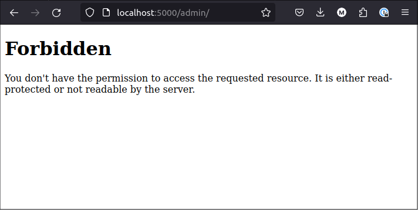
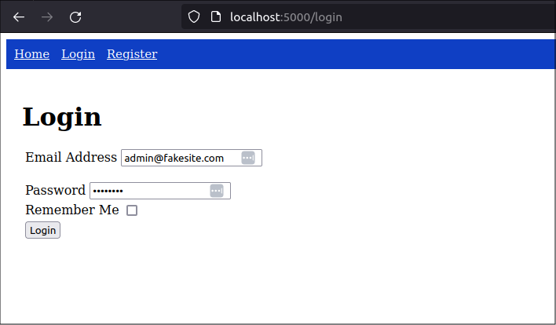

title: Use Flask-Security-Too to implement user roles and permissions 
slug: flask-security-users-roles
summary: Implemnent role-based access control (RBAC) on your web app. I will create two roles with defined permissions and assign those roles and permissions to users of my web app. Then I check for the correct roles and permissions before I allow access to specific web app pages.
date: 2024-05-01
modified: 2024-05-01
category: Flask
status: Draft

<!--
A bit of extra CSS code to centre all images in the post
-->
<style>
img
{
    display:block; 
    float:none; 
    margin-left:auto;
    margin-right:auto;
}
</style>


get tagged starting point (.003)

```
$ wget https://github.com/blinklet/music-festival-organizer/archive/refs/tags/0.003.zip
$ unzip 0.003.zip
$ $ ls -1
0.002.zip
music-festival-organizer-0.003
$ cd music-festival-organizer-0.003
$ ls -1
docs
LICENSE.txt
mfo
README.md
requirements.txt
```

Create and activare the Python virtual environment, then install the required packages

```text
$ python3 -m venv .venv
$ source .venv/bin/activate
(.venv) $ pip install -r requirements.txt
```

Go to the *mfo* application directory:

```text
$ cd mfo
```

Set up the configuration variables for development in a new file named *.env*. Copy the file *dotenv_example* to *.env*.

```text
$ cp dotenv_example .env
```

Run the existing program to see how it works

```text
$ flask run
```

# Add users, roles, and permissions

Flask has a CLI and Flask-Security-Too regitered two additional commands in the Flask CLI. The commands are:

* *users*: configures new users and manages existing users
* *roles*: creates and manages roles and permissions, and assigns roles to users

Use these commands to create two users and to assign roles and permissions. I want to have a user names *admin* with administrative privilleges and a user named *user* with normal user-level privilleges.

First, create the isers:

```text
$ flask users create --password abcd1234 user@security.com
$ flask users activate user@security.com
$ flask users create --password abcd1234 admin@security.com
$ flask users activate admin@security.com
```

Then, create the roles and permissions

```text
$ flask roles create -p admin-read,admin-write Admin
$ flask roles create -p user-read,user-write User
```

Finally, assign the roles to each user

```text
$ flask roles add admin@security.com Admin
$ flask roles add admin@security.com User
$ flask roles add user@security.com User
```

Use the *--help* option in any command to learn how to use it.

Then, start the app

```text
$ flask run
```

Now, you can login as either user but you will have the same experience regardless of which user logs in. For example, both users can access the *Admin* page:

|[](./images/admin_page.png)

Our goal is to restrict access to the Admin page to only users who have the *Admin* role or have *admin-read* and *admin-write* permissions.


## Add role to *admin* blueprint

In the *mfo/admin/admin.py* file, add the [*flask_security.roles_required* decorator](https://flask-security-too.readthedocs.io/en/stable/api.html#flask_security.roles_required) to the *admin* view function. 

```python
# mfo/admin/admin.py

import flask
from flask_security import roles_required

bp = flask.Blueprint(
    'admin',
    __name__,
    static_folder='static',
    template_folder='templates',
    url_prefix='/admin',
    )


@bp.route('/')
@roles_required('Admin')
def index():
    return flask.render_template('/admin/index.html')
```

This prevents normal users from accessing the *Admin* page but the app simple sends a 403 error to the browser and it would be better to handle the access issue in a way that looks more professional.




## Add first admin user to database

When installing this program, we need at least one admin user already configured. Only the admin user can assign the Admin role to other users so we need to start with one. Best practice would be to describe the admin user information in the *.env* file so it can be added to the program config. Then, eventually, we would expect the first admin to change their own password, although our program does not yet allow that.

Add the superuser information to the dotenv file, *mfo/.env*

```text
SUPERUSER_ID = admin@fakesite.com
SUPERUSER_PASSWORD = abcd1234
```

Then add the following statements to the *mfo/config.py* file

```python
# The first admin user, called "superuser"
SUPERUSER_EMAIL = os.environ.get("SUPERUSER_ID")
SUPERUSER_PASSWORD = os.environ.get("SUPERUSER_PASSWORD")
SUPERUSER_ROLES = [role['name'] for role in ROLES.values()]
```

The superuser will be assigned every role available to the program, as defined in the *ROLES* dictionary previously defined in *config.py*.

Add the following function to the *mfo/database/setup.py* file:

```python
# Create first admin user
# Run this _after_ roles created in database
def create_superuser(app):
    if app.security.datastore.find_user(email=app.config['SUPERUSER_EMAIL']):
        print('### Superuser already configured ###')
    else:
        app.security.datastore.create_user(
            email=app.config['SUPERUSER_EMAIL'],
            password=hash_password(app.config['SUPERUSER_PASSWORD']),
            roles=app.config['SUPERUSER_ROLES']
        )
        app.security.datastore.commit()
```

Finally, call the function from the main application, *mfo/app.py*. Add it in the same section you create the database.

```python
# Create application database, if one does not exist
with app.app_context():
    setup.create_database(flask.current_app)
    setup.create_roles(flask.current_app)
    setup.create_superuser(flask.current_app)
```

## Test the changes

Delete the database file in the project folder. It is named *app.sqlite*.

Run the flask app again

```text
(.venv) $ flask --app mfo.app run
```

```
(trapped) error reading bcrypt version
Traceback (most recent call last):
  File "/home/brian/Projects/Music Festival Program/music-festival-organizer/.venv/lib/python3.10/site-packages/passlib/handlers/bcrypt.py", line 620, in _load_backend_mixin
    version = _bcrypt.__about__.__version__
AttributeError: module 'bcrypt' has no attribute '__about__'
 * Serving Flask app 'mfo.app'
 * Debug mode: on
WARNING: This is a development server. Do not use it in a production deployment. Use a production WSGI server instead.
 * Running on http://127.0.0.1:5000
Press CTRL+C to quit
 * Restarting with stat
### Superuser already configured ###
 * Debugger is active!
 * Debugger PIN: 730-543-372
```

Ignore the *bcrypt* error. I understand that the latest version of bcrypt causes this error. I expect that the Flask-Security-Too team will eventually provide a fix that matches the new version of bcrypt. Until then, you can ignore this error or pin the specific version of bcrypt in your *requirements.txt* file. Also, Flask-Security-Too support multiple encryption libraries so you could just configure your app to use something other than bcrypt for password hashing and other encryption tasks.

However, I see that my *create_superuser()* function printed the message `### Superuser already configured ###`. But that should not have happened because I am running the program for the first time with no database. After investigating I discovered that [Flask's DEBUG mode creates at least two instances of the Flask app](https://stackoverflow.com/questions/25504149/why-does-running-the-flask-dev-server-run-itself-twice) when it starts. Since my database code is in the app, it gets run each time the Flask starts an app instance. So, the database functions run at least twice.

For now, it's not a problem because my code can handle the case where roles data and a superuser are already defined in the database. But, it's better to separate this dev code into some commands that can be run using the Flask CLI only when they are needed. I will cover that in a future post.

It can also be worked around by running the flask command with the *--no-reload* parameter. Delete the database and run teh app again with *--no-reload*:

```text
(.venv) $ rm app.sqlite
(.venv) $ flask --app mfo.app run --no-reload
```

```text
(trapped) error reading bcrypt version
<... ignore bcrypt error...>
 * Serving Flask app 'mfo.app'
 * Debug mode: on
WARNING: This is a development server. Do not use it in a production deployment. Use a production WSGI server instead.
 * Running on http://127.0.0.1:5000
Press CTRL+C to quit
```

We see that the function did not execute a second time and find its superuser already existing in the database.

test by logging is as the superuser




# Code

.env

```text
# mfo/.env 

# Application variables
# ---------------------
FLASK_ENVIRONMENT = development
FLASK_APP = app
FLASK_DEBUG = True
FLASK_SECRET_KEY = LGBoUEDCCpgwxy5jZxpu9e01MTnRVqnG6A8ceD7Z4YU
FLASK_EXPLAIN_TEMPLATE_LOADING = False


# Flask-SQLAlchemy variables
# --------------------------
SQLALCHEMY_DATABASE_URI = ""
SQLALCHEMY_ECHO = False


# Flask-Security variables
# ---------------------
SECURITY_PASSWORD_SALT  = 307680677384259925768439955171685999662
SUPERUSER_ID = admin@fakesite.com
SUPERUSER_PASSWORD = abcd1234
```

config.py

```python
# mfo/config.py

import os
import dotenv


app_dir = os.path.abspath(os.path.dirname(__file__))
project_dir = os.path.dirname(app_dir)
dotenv.load_dotenv()

# General Config
ENVIRONMENT = os.environ.get("FLASK_ENVIRONMENT")
DEBUG = os.environ.get("FLASK_DEBUG")
SECRET_KEY = os.environ.get("FLASK_SECRET_KEY")
SERVER_NAME = os.environ.get("FLASK_SERVER_NAME")
EXPLAIN_TEMPLATE_LOADING = os.environ.get("FLASK_EXPLAIN_TEMPLATE_LOADING")

# Flask-SQLAlchemy variables
if ENVIRONMENT == "development":
     SQLALCHEMY_DATABASE_URI = os.environ.get("SQLALCHEMY_DATABASE_URI")\
          or 'sqlite:///' + os.path.join(project_dir, 'app.sqlite')
else:
     SQLALCHEMY_DATABASE_URI = os.environ.get("SQLALCHEMY_DATABASE_URI")
SQLALCHEMY_ECHO = os.environ.get("SQLALCHEMY_ECHO")
SQLALCHEMY_TRACK_MODIFICATIONS = os.environ.get("SQLALCHEMY_TRACK_MODIFICATIONS")
SQLALCHEMY_ENGINE_OPTIONS = {"pool_pre_ping": True} 

# Flask-Security variables
SECURITY_PASSWORD_SALT = os.environ.get("SECURITY_PASSWORD_SALT")
SECURITY_ANONYMOUS_USER_DISABLED = True 
SECURITY_REGISTERABLE = True
SECURITY_SEND_REGISTER_EMAIL = False

# Roles (name, description, set of permissions)
ROLES  = {
    'USER': {
        'name': 'User',
        'description': 'Normal users',
        'permissions': { 'read', 'write' }
    },
    'ADMIN': {
        'name': 'Admin',
        'description': 'Administrators',
        'permissions': { 'read', 'write' }
    },
}


# The first admin user, called "superuser"
SUPERUSER_EMAIL = os.environ.get("SUPERUSER_ID")
SUPERUSER_PASSWORD = os.environ.get("SUPERUSER_PASSWORD")
SUPERUSER_ROLES = [role['name'] for role in ROLES.values()]
```

setup.py

```python
# mfo/database/setup.py
 
from flask_sqlalchemy import SQLAlchemy
from sqlalchemy.orm import DeclarativeBase
from flask_security import hash_password

class Base(DeclarativeBase):
    pass

db = SQLAlchemy(model_class=Base)

# Create database, if none 
def create_database(app):
    security = app.security
    security.datastore.db.create_all()

# Create roles in database
def create_roles(app):
    roles_dict = app.config['ROLES']
    roles_keys = roles_dict.keys()
    for key in roles_keys:
        role=roles_dict[key]
        app.security.datastore.find_or_create_role(
            name=role['name'], 
            description=role['description'],
            permissions=role['permissions']
    )
    app.security.datastore.commit()


# Create first admin user
# Run this _after_ roles created in database
def create_superuser(app):
    if app.security.datastore.find_user(email=app.config['SUPERUSER_EMAIL']):
        print('### Superuser already configured ###')
    else:
        app.security.datastore.create_user(
            email=app.config['SUPERUSER_EMAIL'],
            password=hash_password(app.config['SUPERUSER_PASSWORD']),
            roles=app.config['SUPERUSER_ROLES']
        )
        app.security.datastore.commit()
```

app.py

```python
# mfo/app.py

import flask
from flask_security import Security
from mfo.database import setup
from mfo.database.models.users import user_datastore
from flask_security.signals import user_registered


app = flask.Flask(__name__)
app.config.from_pyfile('config.py', silent=True)

# Register Flask-SQLAlchemy
setup.db.init_app(app)

# Register Flask-Security-Too
app.security = Security(app, user_datastore)

# Register blueprints
from mfo.admin import admin
from mfo.home import home
from mfo.account import account
app.register_blueprint(home.bp)
app.register_blueprint(account.bp)
app.register_blueprint(admin.bp)

# Create application database, if one does not exist
with app.app_context():
    setup.create_database(flask.current_app)
    setup.create_roles(flask.current_app)
    setup.create_superuser(flask.current_app)


# Assign "User" role to all newly-registered users
@user_registered.connect_via(app)
def user_registered_sighandler(sender, user, **extra):
    role = "User"
    user_datastore.add_role_to_user(user, role)

if __name__ == "__main__":
    app.run()
```

admin.py

```python
import flask
from flask_security import roles_required
from werkzeug.exceptions import Forbidden

bp = flask.Blueprint(
    'admin',
    __name__,
    static_folder='static',
    template_folder='templates',
    url_prefix='/admin',
    )


@bp.route('/')
@roles_required('Admin')
def index():
    return flask.render_template('/admin/index.html')

@bp.errorhandler(Forbidden)
def handle_forbidden(e):
    return flask.render_template('forbidden.html', role="Admin")
```

*forbidden.html* template 

```html
<!-- mfo/templates/forbidden.html -->


Access forbidden


    <div>
        <h1>Access forbidden</h1>

        <div>
            Sorry, you must be a {{role}} to access this page 
        </div>
    </div>



```

shared_layout.html

```html
Place the *forbidden.html* template in the application's *templates* folder, because it can be used by any blueprint or view function.

```html
<!-- mfo/templates/forbidden.html -->


Access forbidden


    <div>
        <h1>Access forbidden</h1>

        <div>
            Sorry, you must be a {{role}} to access this page 
        </div>
    </div>



```

# Conclusion

We added roles to the flask-security-too configuration and used them to define which operations are visible to users, depending whether they are logged out, or logged in, and depending on whether they have the *User* role or the *Admin* role.

