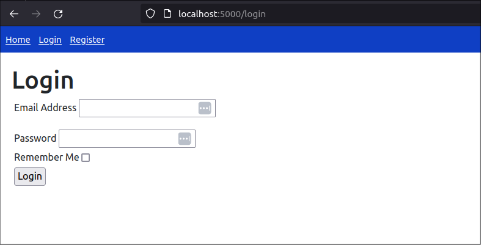
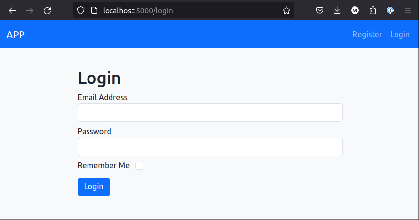
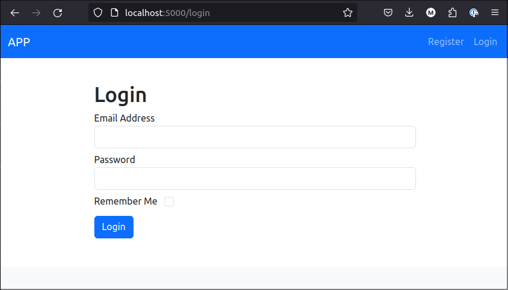
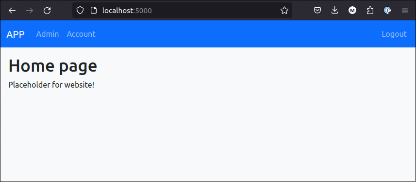

title: Make your Flask website look great with Bootstrap 
slug: add-bootstrap-css-flask-website
summary: Boostrap-Flask makes it easier to add Bootstrap and use Bootstrap macros on your Flask web app. This post shows how I improved the appearance of my site with Bootstrap.
date: 2024-05-14
modified: 2024-05-14
category: Flask
status: Draft

<!--
A bit of extra CSS code to centre all images in the post
-->
<style>
img
{
    display:block; 
    float:none; 
    margin-left:auto;
    margin-right:auto;
}
</style>


get tagged starting point (.005)

```
$ wget https://github.com/blinklet/music-festival-organizer/archive/refs/tags/0.005.zip
$ unzip 0.003.zip
$ $ ls -1
0.005.zip
music-festival-organizer-0.005
$ cd music-festival-organizer-0.005
```

Create and activare the Python virtual environment, then install the required packages

```text
$ python3 -m venv .venv
$ source .venv/bin/activate
(.venv) $ pip install -r requirements.txt
```

Go to the *mfo* application directory:

```text
$ cd mfo
```

Set up the configuration variables for development in a new file named *.env*. Copy the file *dotenv_example* to *.env*.

```text
$ cp dotenv_example .env
```

Run the existing program to see how it works

```text
$ flask run
```

# Bootstrap

https://getbootstrap.com/

https://expo.getbootstrap.com

Free Bootstrap themes
https://bootswatch.com
https://startbootstrap.com

Purchase themes
https://wrapbootstrap.com

Free stock photos
https://unsplash.com

Examples
https://getbootstrap.com/docs/5.0/examples/

# Boostrap-Flask

https://github.com/helloflask/bootstrap-flask


## Install

Add Boostrap-Flask to the *requirements.txt* file

```python
# requirements.txt

flask
python-dotenv
Flask-Security-Too[fsqla,common]
bootstrap-flask
```

```text
(.venv) $ pip install -r requirements.txt
```

Next, include the bootstrap-flask CSS and Javascript [resource helpers](https://bootstrap-flask.readthedocs.io/en/stable/basic/#resources-helpers) to the *shared_layout.html* template

Add the following lines in the `<head>` section of the html page

```html
    <meta name="viewport" content="width=device-width, initial-scale=1, shrink-to-fit=no">

    {{ bootstrap.load_css() }}
```

Add the following line at the end of the `<body>` section of the page

```html
    {{ bootstrap.load_js() }}
```

The final template looks like below:

```html
<!DOCTYPE html>
<html lang="en">
<head>
    <meta charset="UTF-8">
    <meta name="viewport" content="width=device-width, initial-scale=1, shrink-to-fit=no">

    <title>Music Festival Website</title>

    <link rel="stylesheet" href="/static/css/styles.css" />
    {{ bootstrap.load_css() }}

    
</head>

<body>
    <nav>
        <a href="{{ url_for('home.index') }}">Home</a>
        
        <a href="{{ url_for('admin.index') }}">Admin</a>
        
        
        <a href="{{ url_for('account.index') }}">Account</a>
        
        
        <a href="{{ url_for_security('login') }}">Login</a>
        <a href="{{ url_for_security('register') }}">Register</a>
        
        
        <a href="{{ url_for_security('logout') }}">Logout</a>
        
    </nav>
    <div class="main_content">
        
        <h1>This is a simple example page</h1>
        
    </div>

    {{ bootstrap.load_js() }}

</body>
</html>
```

In the *app.py*, import the Bootstrap-Flask extension and register it. Simply import Bootstrap5 from *flask_bootstrap* and register it after you create the app. The code snippet below show the changes in the *app.py* file

```python
from flask_bootstrap import Bootstrap5


app = flask.Flask(__name__)
app.config.from_pyfile('config.py', silent=True)

# Register Bootstrap-Flask
bootstrap = Bootstrap5(app)
```

The complete app.py file now looks like:

```python
# mfo/app.py

import flask
from flask_security import Security
from mfo.database import setup
from mfo.database.models.users import user_datastore
from flask_security.signals import user_registered
from flask_bootstrap import Bootstrap5


app = flask.Flask(__name__)
app.config.from_pyfile('config.py', silent=True)

# Register Bootstrap-Flask
bootstrap = Bootstrap5(app)

# Register Flask-SQLAlchemy
setup.db.init_app(app)

# Register Flask-Security-Too
app.security = Security(app, user_datastore)

# Register blueprints
from mfo.admin import admin
from mfo.home import home
from mfo.account import account
app.register_blueprint(home.bp)
app.register_blueprint(account.bp)
app.register_blueprint(admin.bp)

# Create application database, if one does not exist
with app.app_context():
    setup.create_database(flask.current_app)
    setup.create_roles(flask.current_app)
    setup.create_superuser(flask.current_app)


# Assign "User" role to all newly-registered users
@user_registered.connect_via(app)
def user_registered_sighandler(sender, user, **extra):
    role = "User"
    user_datastore.add_role_to_user(user, role)

if __name__ == "__main__":
    app.run()
```

### First test

Then, run the app to see the affect

```text
(.venv) $ flask --app mfo.app run
```

Immediately, the default Bootstrap fonts make the web site looks better.



# Bootstrap CSS styles

In the *templates/security/login_user.html* file, add bootstrap classes to the form fields.

* Add the *form-control* class to the *render_field* and/or *render_filed_with_errors* function calls in the email and password fields.
* Add the *btn* and *btn-primary* classes to the submit field
* Add the "form-check-input" class to the "remember" checkbox

The form section of the template will look like below

```html
  <form action="{{ url_for_security('login') }}{{ prop_next() }}" method="post" name="login_user_form">
    {{ login_user_form.hidden_tag() }}
    {{ render_form_errors(login_user_form) }}
    {{ render_field_with_errors(login_user_form.email, class_="form-control") }}
    
      <h3>{{ _fsdomain("or") }}</h3>
      {{ render_field_with_errors(login_user_form.username, class_="form-control") }}
    
    <div class="fs-gap">{{ render_field_with_errors(login_user_form.password, class_="form-control") }}</div>
    {{ render_field_with_errors(login_user_form.remember, class="form-check-input") }}
    {{ render_field_errors(login_user_form.csrf_token) }}
    {{ render_field(login_user_form.submit, class_="btn btn-primary") }}
  </form>
```

Then text the page. Go to the *Login* page



See that the form is styled more attractively but the fields stretch all the way accross the page. We may want to make the login panel fit into a more compact space. One way to do this is to use the Boostrap grid. We'll look at that later.

Do the same for other template that have forms in them. At this point, that is the *security/change_password.html* and *security/register_user.html* templates.

## Navbar

Let's use some bootstrap classes to make the NavBar look better. Look at the Boostrap documentation for navbars to get example code.

In *templates/shared_layout.html*, replace the *<nav>..</nav>* section with the following:

```html
<nav class="navbar navbar-expand-sm bg-primary" data-bs-theme="dark">
    <div class="container-fluid">
        <a class="navbar-brand" href="{{ url_for('home.index') }}">APP</a>
        <button class="navbar-toggler" type="button" data-bs-toggle="collapse" data-bs-target="#navbarCollapsed" aria-controls="navbarCollapsed" aria-expanded="false" aria-label="Toggle navigation">
            <span class="navbar-toggler-icon"></span>
        </button>
        <div class="collapse navbar-collapse" id="navbarCollapsed">
            <div class="navbar-nav me-auto">
            
                <a class="nav-link" href="{{ url_for('admin.index') }}">Admin</a>
            
            
                <a class="nav-link" href="{{ url_for('account.index') }}">Account</a>
            
        </div>
        <div class="navbar-nav ms-auto">
            
                <a class="nav-link" href="{{ url_for_security('register') }}">Register</a>
                <a class="nav-link" href="{{ url_for_security('login') }}">Login</a>
            
            
                <a class="nav-link" href="{{ url_for_security('logout') }}">Logout</a>
            
        </div>
    </div>
</nav>
```

# Bootstrap styles for information pages

## Remove custom styles

First, I commented out the CSS styles I previously created in the files, *static/css/style.css* and *account/static/css/styles.css*.

## Style the shared layout

Change the `<bod>` tag to `<body class="bg-light">` to give the background a light-grey color

Change the `<div class="main_content">` to `<div class="container_fluid p-3">` to give each page a bit of padding around it


## Style the login page

Center the login form. Place the form in a smaller space.

Around the login content create divs for the Bootstrap row and column. You need these so that the table element lign up with the heading on the login page, and to give some space around the login form. Also, color the row white so it stands out a bit.

```html
<div class="row pt-4 pb-4 bg-white">
  <div class="col-sm-2">
  </div>
  <div class="col-sm-8">
    ...
  </div>
  <div class="col-sm-2">
  </div>
</div>
```

[Add Bootstrap classes](https://stackoverflow.com/questions/34659619/flask-security-and-bootstrap) to the *render_field_with_errors* and *render_field* macros in the *templates/login_user.html* file. Use the `class_=` attribute

For example:

```html
{{ render_field_with_errors(login_user_form.email, class_="form-control mb-2") }}
```

the template will look like the following:

```html
<div class="row pt-4 pb-4">
    <div class="col-sm-2">
    </div>
    <div class="col-sm-8">
        
        <h1 class="legend">{{ _fsdomain('Login') }}</h1>
        <form action="{{ url_for_security('login') }}{{ prop_next() }}" method="post" name="login_user_form">
            {{ login_user_form.hidden_tag() }}
            {{ render_form_errors(login_user_form) }}
            {{ render_field_with_errors(login_user_form.email, class_="form-control mb-2") }}
            
            <h3>{{ _fsdomain("or") }}</h3>
            {{ render_field_with_errors(login_user_form.username, class_="form-control mb-2") }}
            
            {{ render_field_with_errors(login_user_form.password, class_="form-control mb-2") }}
            {{ render_field_with_errors(login_user_form.remember, class="form-check-input mb-3 ms-2") }}
            {{ render_field_errors(login_user_form.csrf_token) }}
            {{ render_field(login_user_form.submit, class_="btn btn-primary mb-2") }}
        </form>
        <!-- removed other content -->
    </div>
    <div class="col-sm-2">
    </div>
</div>
```

And this reults in a "good-enough" login page:




Now, do the same to the *Register* template and the *Change Password* template

# Conclusion

I still need to add styles to teh *Home* page, *Admin* page, and *Account* page but I'll do that when I create content for those pages.

For now, you can see that the default Bootstrap styles, along with the container padding I defoned in teh sgared layout template, create a not-bad-looking home page:



